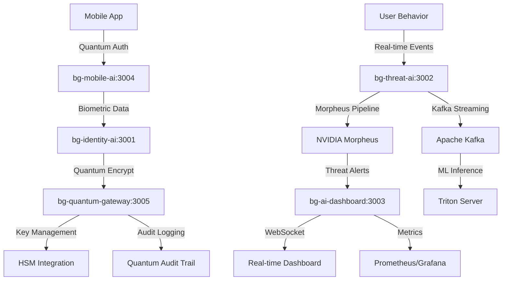

# Service-Specific Quantum Implementation Plans
## Detailed Library Integration & Implementation Roadmaps

---

## **🔐 bg-identity-ai: Quantum-Secure Identity Verification**
### **Port 3001 | Biometric & Document Processing Service**

### **Primary Libraries & Technologies**

#### **1. OpenQuantumSafe (liboqs) Integration**
```typescript
// Core quantum cryptography implementation
import * as oqs from 'liboqs-node';

export class QuantumBiometricSecurity {
  private kemAlgorithm = 'Kyber768';      // NIST Level 3 security
  private sigAlgorithm = 'Dilithium3';    // 192-bit equivalent

  async encryptBiometricTemplate(
    userId: string,
    template: Buffer,
    biometricType: 'face' | 'fingerprint' | 'iris'
  ): Promise<QuantumEncryptedTemplate> {
    // Generate quantum-safe keypair
    const kem = new oqs.KeyEncapsulation(this.kemAlgorithm);
    const keypair = kem.generate_keypair();
    
    // Encapsulate shared secret
    const encapResult = kem.encap_secret(keypair.public_key);
    
    // Use shared secret for AES-256-GCM encryption
    const cipher = crypto.createCipher('aes-256-gcm', encapResult.shared_secret);
    const encryptedTemplate = cipher.update(template);
    
    return {
      userId,
      biometricType,
      encryptedData: encryptedTemplate.toString('base64'),
      ciphertext: encapResult.ciphertext.toString('base64'),
      publicKey: keypair.public_key.toString('base64'),
      algorithm: this.kemAlgorithm,
      timestamp: new Date().toISOString(),
      securityLevel: 'NIST-L3'
    };
  }

  async verifyQuantumSignature(
    documentData: Buffer,
    signature: Buffer,
    publicKey: Buffer
  ): Promise<DocumentVerificationResult> {
    const sig = new oqs.Signature(this.sigAlgorithm);
    const isValid = sig.verify(documentData, signature, publicKey);
    
    return {
      isValid,
      algorithm: this.sigAlgorithm,
      securityLevel: 'NIST-L3',
      confidence: isValid ? 0.99 : 0.0,
      timestamp: new Date().toISOString()
    };
  }
}
```

#### **2. OpenID Connect Quantum Extensions**
```typescript
// Quantum-enhanced OIDC implementation
export class QuantumOIDCProvider {
  private quantumCrypto: QuantumBiometricSecurity;
  
  async generateQuantumJWKS(): Promise<QuantumJWKS> {
    // Generate post-quantum public keys for JWKS
    const kemKeypair = await this.quantumCrypto.generateKEMKeyPair();
    const sigKeypair = await this.quantumCrypto.generateSignatureKeyPair();
    
    return {
      keys: [
        {
          kty: 'PQC',                    // Post-Quantum Cryptography
          alg: 'Kyber768',
          use: 'enc',
          kid: 'quantum-kem-1',
          k: kemKeypair.publicKey.toString('base64url'),
          'pqc-kem': 'Kyber768'
        },
        {
          kty: 'PQC',
          alg: 'Dilithium3',
          use: 'sig',
          kid: 'quantum-sig-1',
          k: sigKeypair.publicKey.toString('base64url'),
          'pqc-sig': 'Dilithium3'
        }
      ]
    };
  }

  async issueHybridToken(userClaims: UserClaims): Promise<HybridToken> {
    // Issue both classical JWT and quantum-safe token
    const classicalJWT = jwt.sign(userClaims, process.env.JWT_SECRET);
    const quantumToken = await this.quantumCrypto.generateHybridToken(userClaims);
    
    return {
      access_token: quantumToken.hybridToken,
      token_type: 'Hybrid',
      expires_in: 3600,
      classical_fallback: classicalJWT,
      quantum_algorithms: ['Kyber768', 'Dilithium3'],
      security_level: 'NIST-L3'
    };
  }
}
```

#### **3. Biometric Processing Libraries**
```typescript
// Advanced biometric processing with quantum security
export class SecureBiometricProcessor {
  private quantumSecurity: QuantumBiometricSecurity;
  
  // Face recognition with quantum-encrypted templates
  async processFaceRecognition(imageBuffer: Buffer, userId: string): Promise<FaceVerificationResult> {
    // Extract facial features (using MediaPipe/OpenCV)
    const faceFeatures = await this.extractFacialFeatures(imageBuffer);
    
    // Generate quantum-encrypted template
    const encryptedTemplate = await this.quantumSecurity.encryptBiometricTemplate(
      userId, 
      Buffer.from(faceFeatures), 
      'face'
    );
    
    // Store in quantum-secure database
    await this.storeBiometricTemplate(userId, encryptedTemplate);
    
    return {
      userId,
      templateId: encryptedTemplate.templateId,
      confidence: 0.95,
      quantumSecured: true,
      algorithm: 'Face Recognition + Kyber768',
      biometricQuality: this.assessBiometricQuality(faceFeatures)
    };
  }

  // Fingerprint processing with minutiae extraction
  async processFingerprintRecognition(imageBuffer: Buffer, userId: string): Promise<FingerprintResult> {
    // Extract minutiae points
    const minutiae = await this.extractMinutiae(imageBuffer);
    const fingerprintHash = this.generateFingerprintHash(minutiae);
    
    // Quantum-encrypt minutiae template
    const encryptedTemplate = await this.quantumSecurity.encryptBiometricTemplate(
      userId,
      Buffer.from(JSON.stringify(minutiae)),
      'fingerprint'
    );
    
    return {
      userId,
      fingerprintHash,
      minutiaeCount: minutiae.length,
      encryptedTemplate,
      quality: this.assessFingerprintQuality(imageBuffer),
      quantumSecured: true
    };
  }

  // Document authentication with quantum signatures
  async authenticateDocument(documentBuffer: Buffer, documentType: string): Promise<DocumentAuthResult> {
    // Extract document features and text (OCR)
    const documentFeatures = await this.extractDocumentFeatures(documentBuffer);
    const ocrText = await this.performOCR(documentBuffer);
    
    // Analyze security features
    const securityAnalysis = await this.analyzeSecurityFeatures(documentBuffer, documentType);
    
    // Generate quantum signature for document authenticity
    const documentHash = crypto.createHash('sha3-256').update(documentBuffer).digest();
    const quantumSignature = await this.quantumSecurity.signMessage(
      documentHash,
      await this.getDocumentSigningKey()
    );
    
    return {
      documentType,
      isAuthentic: securityAnalysis.confidence > 0.8,
      confidence: securityAnalysis.confidence,
      extractedText: ocrText,
      securityFeatures: securityAnalysis.features,
      quantumSignature,
      verificationLevel: 'NIST-L3'
    };
  }
}
```

### **API Endpoints Implementation**
```typescript
// bg-identity-ai/src/routes/quantum-biometric.ts
router.post('/api/biometric/quantum-enroll', async (req, res) => {
  const { userId, biometricData, biometricType } = req.body;
  
  // Validate input with Zod
  const schema = z.object({
    userId: z.string(),
    biometricData: z.string(), // base64 encoded image
    biometricType: z.enum(['face', 'fingerprint', 'iris'])
  });
  
  const validatedData = schema.parse(req.body);
  
  // Process with quantum security
  const processor = new SecureBiometricProcessor();
  const result = await processor.processBiometricEnrollment(
    Buffer.from(validatedData.biometricData, 'base64'),
    validatedData.userId,
    validatedData.biometricType
  );
  
  res.json({
    success: true,
    templateId: result.templateId,
    quantumSecured: true,
    securityLevel: 'NIST-L3',
    enrollmentConfidence: result.confidence
  });
});

router.post('/api/document/quantum-verify', async (req, res) => {
  const { documentImage, documentType, expectedData } = req.body;
  
  const processor = new SecureBiometricProcessor();
  const result = await processor.authenticateDocument(
    Buffer.from(documentImage, 'base64'),
    documentType
  );
  
  res.json({
    success: result.isAuthentic,
    confidence: result.confidence,
    quantumVerified: true,
    securityFeatures: result.securityFeatures,
    extractedData: result.extractedText
  });
});
```

---

## **🛡️ bg-threat-ai: NVIDIA Morpheus Threat Detection**
### **Port 3002 | Real-time Behavioral Analysis Service**

### **Primary Libraries & Technologies**

#### **1. NVIDIA Morpheus Integration**
```python
# morpheus-pipelines/bg-threat-detection-pipeline.py
import morpheus
from morpheus.config import Config
from morpheus.pipeline import LinearPipeline
from morpheus.stages.input import KafkaSourceStage
from morpheus.stages.preprocess import DeserializeStage, PreprocessFILStage
from morpheus.stages.inference import AutoEncoderInferenceStage
from morpheus.stages.postprocess import AddClassificationsStage
from morpheus.stages.output import KafkaSinkStage
from morpheus.stages.general import MonitorStage

class BehaviorGuardThreatPipeline:
    def __init__(self, config_path: str):
        self.config = self.load_config(config_path)
        self.setup_morpheus_config()
    
    def setup_morpheus_config(self):
        """Configure Morpheus for BehaviorGuard threat detection."""
        self.morpheus_config = Config()
        self.morpheus_config.mode = 'streaming'
        self.morpheus_config.pipeline_batch_size = 1024
        self.morpheus_config.edge_buffer_size = 128
        self.morpheus_config.model_max_batch_size = 1024
        self.morpheus_config.feature_length = 256
        
    def build_pipeline(self) -> LinearPipeline:
        """Build the GPU-accelerated threat detection pipeline."""
        pipeline = LinearPipeline(self.morpheus_config)
        
        # Input: Read threat events from Kafka
        pipeline.add_stage(KafkaSourceStage(
            self.morpheus_config,
            bootstrap_servers="kafka:9092",
            input_topic="threat-events",
            consumer_group="bg-morpheus-consumer",
            client_id="bg-threat-detection"
        ))
        
        # Preprocessing: Deserialize and prepare features
        pipeline.add_stage(DeserializeStage(self.morpheus_config))
        pipeline.add_stage(MonitorStage(self.morpheus_config, description="Input Rate"))
        
        pipeline.add_stage(PreprocessFILStage(
            self.morpheus_config,
            timestamp_column_name="timestamp",
            source_column_name="source"
        ))
        
        # AI Inference: Multiple models for comprehensive analysis
        
        # 1. AutoEncoder for anomaly detection
        pipeline.add_stage(AutoEncoderInferenceStage(
            self.morpheus_config,
            model_name="bg-anomaly-detection",
            server_url="triton-inference-server:8001"
        ))
        
        # 2. LSTM for sequence analysis
        pipeline.add_stage(SequenceAnalysisStage(
            self.morpheus_config,
            model_name="bg-sequence-analysis",
            server_url="triton-inference-server:8001"
        ))
        
        # 3. Transformer for behavioral patterns
        pipeline.add_stage(BehavioralTransformerStage(
            self.morpheus_config,
            model_name="bg-behavior-transformer",
            server_url="triton-inference-server:8001"
        ))
        
        # Post-processing: Classify threats and generate alerts
        pipeline.add_stage(AddClassificationsStage(
            self.morpheus_config,
            labels=["normal", "suspicious", "threat", "critical"],
            threshold=0.7
        ))
        
        pipeline.add_stage(ThreatScoringStage(self.morpheus_config))
        pipeline.add_stage(MonitorStage(self.morpheus_config, description="Threat Detection Rate"))
        
        # Output: Send alerts to Kafka
        pipeline.add_stage(KafkaSinkStage(
            self.morpheus_config,
            bootstrap_servers="kafka:9092",
            output_topic="threat-alerts"
        ))
        
        return pipeline
    
    def run_pipeline(self):
        """Execute the threat detection pipeline."""
        pipeline = self.build_pipeline()
        print("🔥 Starting BehaviorGuard Morpheus Threat Detection Pipeline...")
        print(f"📊 Target: {self.config['performance']['target_throughput']} events/sec")
        print(f"⚡ Latency: <{self.config['performance']['max_latency']}ms")
        
        pipeline.run()
```

#### **2. Custom ML Models for Threat Detection**
```python
# bg-threat-ai/models/threat-detection-models.py
import tensorflow as tf
import numpy as np
from typing import Dict, List

class BehavioralAnomalyDetector:
    """AutoEncoder-based anomaly detection for user behavior."""
    
    def __init__(self, input_dim: int = 15, encoding_dim: int = 8):
        self.input_dim = input_dim
        self.encoding_dim = encoding_dim
        self.model = self._build_autoencoder()
        
    def _build_autoencoder(self) -> tf.keras.Model:
        # Input layer
        input_layer = tf.keras.layers.Input(shape=(self.input_dim,))
        
        # Encoder
        encoded = tf.keras.layers.Dense(32, activation='relu')(input_layer)
        encoded = tf.keras.layers.Dropout(0.2)(encoded)
        encoded = tf.keras.layers.Dense(16, activation='relu')(encoded)
        encoded = tf.keras.layers.Dense(self.encoding_dim, activation='relu')(encoded)
        
        # Decoder
        decoded = tf.keras.layers.Dense(16, activation='relu')(encoded)
        decoded = tf.keras.layers.Dense(32, activation='relu')(decoded)
        decoded = tf.keras.layers.Dropout(0.2)(decoded)
        decoded = tf.keras.layers.Dense(self.input_dim, activation='sigmoid')(decoded)
        
        # Compile model
        autoencoder = tf.keras.Model(input_layer, decoded)
        autoencoder.compile(
            optimizer='adam',
            loss='mse',
            metrics=['mae']
        )
        
        return autoencoder
    
    def detect_anomalies(self, user_behaviors: np.ndarray, threshold: float = 0.1) -> Dict:
        """Detect behavioral anomalies using reconstruction error."""
        # Get reconstructions
        reconstructions = self.model.predict(user_behaviors)
        
        # Calculate reconstruction errors
        mse = np.mean(np.power(user_behaviors - reconstructions, 2), axis=1)
        
        # Identify anomalies
        anomalies = mse > threshold
        
        return {
            'anomaly_scores': mse.tolist(),
            'anomalies': anomalies.tolist(),
            'threshold': threshold,
            'anomaly_count': int(np.sum(anomalies)),
            'max_score': float(np.max(mse)),
            'mean_score': float(np.mean(mse))
        }

class SequenceThreatDetector:
    """LSTM-based sequence analysis for threat patterns."""
    
    def __init__(self, sequence_length: int = 50, features: int = 15):
        self.sequence_length = sequence_length
        self.features = features
        self.model = self._build_lstm_model()
    
    def _build_lstm_model(self) -> tf.keras.Model:
        model = tf.keras.Sequential([
            tf.keras.layers.LSTM(64, return_sequences=True, 
                               input_shape=(self.sequence_length, self.features)),
            tf.keras.layers.Dropout(0.3),
            tf.keras.layers.LSTM(32, return_sequences=False),
            tf.keras.layers.Dropout(0.3),
            tf.keras.layers.Dense(16, activation='relu'),
            tf.keras.layers.Dense(1, activation='sigmoid')  # Threat probability
        ])
        
        model.compile(
            optimizer='adam',
            loss='binary_crossentropy',
            metrics=['accuracy', 'precision', 'recall']
        )
        
        return model
    
    def predict_threat_sequence(self, behavior_sequences: np.ndarray) -> Dict:
        """Predict threat probability for behavior sequences."""
        threat_probabilities = self.model.predict(behavior_sequences)
        
        return {
            'threat_probabilities': threat_probabilities.flatten().tolist(),
            'high_risk_sequences': (threat_probabilities > 0.8).flatten().tolist(),
            'medium_risk_sequences': ((threat_probabilities > 0.5) & 
                                    (threat_probabilities <= 0.8)).flatten().tolist(),
            'model_confidence': float(np.mean(np.max(threat_probabilities, axis=0)))
        }

class BehavioralTransformer:
    """Transformer-based behavioral pattern analysis."""
    
    def __init__(self, vocab_size: int = 1000, d_model: int = 128):
        self.vocab_size = vocab_size
        self.d_model = d_model
        self.model = self._build_transformer()
    
    def _build_transformer(self) -> tf.keras.Model:
        # Multi-head attention for behavioral patterns
        inputs = tf.keras.layers.Input(shape=(None, self.d_model))
        
        # Multi-head attention
        attention = tf.keras.layers.MultiHeadAttention(
            num_heads=8, key_dim=64
        )(inputs, inputs)
        
        # Add & Norm
        attention = tf.keras.layers.Dropout(0.1)(attention)
        attention = tf.keras.layers.LayerNormalization()(inputs + attention)
        
        # Feed forward
        ffn = tf.keras.layers.Dense(512, activation='relu')(attention)
        ffn = tf.keras.layers.Dense(self.d_model)(ffn)
        ffn = tf.keras.layers.Dropout(0.1)(ffn)
        
        # Add & Norm
        outputs = tf.keras.layers.LayerNormalization()(attention + ffn)
        
        # Classification head
        pooled = tf.keras.layers.GlobalAveragePooling1D()(outputs)
        threat_score = tf.keras.layers.Dense(1, activation='sigmoid')(pooled)
        
        model = tf.keras.Model(inputs, threat_score)
        model.compile(
            optimizer='adam',
            loss='binary_crossentropy',
            metrics=['accuracy']
        )
        
        return model
```

#### **3. Real-time Threat Processing Service**
```typescript
// bg-threat-ai/src/services/morpheus-threat-service.ts
import { EventEmitter } from 'events';
import { KafkaProducer, KafkaConsumer } from 'kafkajs';
import { WebSocketServer } from 'ws';

export class MorpheusThreatService extends EventEmitter {
  private kafkaProducer: KafkaProducer;
  private kafkaConsumer: KafkaConsumer;
  private wsServer: WebSocketServer;
  private morpheusPipeline: ChildProcess | null = null;

  constructor() {
    super();
    this.initializeKafka();
    this.initializeWebSocket();
    this.startMorpheusPipeline();
  }

  async processRealTimeThreat(event: ThreatEvent): Promise<ThreatAnalysis> {
    // Send event to Morpheus pipeline via Kafka
    await this.kafkaProducer.send({
      topic: 'threat-events',
      messages: [{
        key: event.userId,
        value: JSON.stringify({
          user_id: event.userId,
          timestamp: event.timestamp,
          source: event.source,
          // Behavioral features for ML models
          login_frequency: event.loginFrequency,
          device_fingerprint: event.deviceFingerprint,
          location_consistency: event.locationConsistency,
          typing_patterns: event.typingPatterns,
          navigation_behavior: event.navigationBehavior,
          session_duration: event.sessionDuration,
          api_usage_patterns: event.apiUsagePatterns,
          failed_attempts: event.failedAttempts,
          privilege_escalation: event.privilegeEscalation,
          data_access_patterns: event.dataAccessPatterns,
          network_behavior: event.networkBehavior,
          biometric_confidence: event.biometricConfidence,
          quantum_auth_used: event.quantumAuthUsed,
          risk_indicators: event.riskIndicators,
          behavioral_score: this.calculateBehavioralScore(event)
        })
      }]
    });

    // Return immediate preliminary analysis
    return {
      eventId: event.eventId,
      userId: event.userId,
      preliminaryRisk: this.calculatePreliminaryRisk(event),
      processingStatus: 'queued_for_morpheus',
      timestamp: new Date().toISOString()
    };
  }

  private async startThreatAlertConsumer(): Promise<void> {
    await this.kafkaConsumer.run({
      eachMessage: async ({ topic, partition, message }) => {
        try {
          const threatDetection = JSON.parse(message.value?.toString() || '{}');
          
          // Process Morpheus ML results
          const enhancedThreat: EnhancedThreatDetection = {
            ...threatDetection,
            morpheusAnalysis: {
              anomalyScore: threatDetection.anomaly_score,
              sequenceThreatScore: threatDetection.sequence_threat_score,
              behavioralPatterns: threatDetection.behavioral_patterns,
              mlConfidence: threatDetection.ml_confidence,
              processingLatency: threatDetection.processing_time_ms
            },
            riskLevel: this.calculateRiskLevel(threatDetection),
            recommendations: this.generateRecommendations(threatDetection),
            quantumSecured: true
          };

          // Emit real-time alert
          this.emit('threat-detected', enhancedThreat);
          
          // Send WebSocket alert to dashboard
          this.broadcastThreatAlert(enhancedThreat);
          
          // Store in quantum-secure database
          await this.storeThreatDetection(enhancedThreat);
          
        } catch (error) {
          logger.error('Failed to process Morpheus threat alert', { error });
        }
      },
    });
  }

  private broadcastThreatAlert(threat: EnhancedThreatDetection): void {
    const alertMessage = {
      type: 'threat_alert',
      data: {
        userId: threat.userId,
        riskLevel: threat.riskLevel,
        threatScore: threat.morpheusAnalysis.anomalyScore,
        timestamp: threat.timestamp,
        recommendations: threat.recommendations
      }
    };

    // Broadcast to all connected WebSocket clients
    this.wsServer.clients.forEach(client => {
      if (client.readyState === WebSocket.OPEN) {
        client.send(JSON.stringify(alertMessage));
      }
    });
  }

  async getBehavioralAnalysis(userId: string, timeRange: string): Promise<BehavioralProfile> {
    // Query behavioral data from quantum-secure database
    const behaviorData = await this.getBehaviorHistory(userId, timeRange);
    
    // Run through ML models for pattern analysis
    const patternAnalysis = await this.analyzeBehavioralPatterns(behaviorData);
    
    return {
      userId,
      timeRange,
      normalPatterns: patternAnalysis.normalBehaviors,
      anomalies: patternAnalysis.detectedAnomalies,
      riskTrends: patternAnalysis.riskTrends,
      behavioralFingerprint: patternAnalysis.fingerprint,
      quantumSecured: true,
      lastUpdated: new Date().toISOString()
    };
  }
}
```

#### **4. Falco Integration for Infrastructure Monitoring**
```yaml
# shared/falco/bg-threat-rules.yaml
# Falco rules for BehaviorGuard infrastructure security

- rule: Quantum Key Access Attempt
  desc: Detect unauthorized access to quantum keys
  condition: >
    open_write and container and
    fd.filename startswith /quantum/keys and
    not proc.name in (quantum-gateway, bg-quantum-gateway)
  output: >
    Unauthorized quantum key access detected
    (user=%user.name proc=%proc.name cmd=%proc.cmdline file=%fd.name container=%container.name)
  priority: CRITICAL
  tags: [quantum, security, keys]

- rule: Unusual AI Model Access
  desc: Detect suspicious access to ML models
  condition: >
    open_read and container and
    fd.filename startswith /workspace/models and
    proc.name not in (morpheus, triton, python) and
    not proc.cmdline contains "bg-threat-detection"
  output: >
    Suspicious AI model access
    (user=%user.name proc=%proc.name file=%fd.name container=%container.name)
  priority: HIGH
  tags: [ai, models, security]

- rule: Biometric Template Tampering
  desc: Detect attempts to tamper with biometric templates
  condition: >
    (open_write or modify) and container and
    fd.filename contains "biometric" and
    not proc.name in (bg-identity-ai, postgres)
  output: >
    Biometric template tampering attempt
    (user=%user.name proc=%proc.name file=%fd.name container=%container.name)
  priority: CRITICAL
  tags: [biometric, tampering, security]
```

---

## **📊 bg-ai-dashboard: Quantum Security Monitoring**
### **Port 3003 | Real-time Analytics & Visualization**

### **Primary Libraries & Technologies**

#### **1. Real-time Dashboard with Quantum Metrics**
```typescript
// bg-ai-dashboard/src/components/QuantumSecurityDashboard.tsx
import React, { useState, useEffect } from 'react';
import { RealtimeChart, SecurityMetrics, ThreatMap } from '@/components/ui';
import { useWebSocket } from '@/hooks/useWebSocket';

export const QuantumSecurityDashboard: React.FC = () => {
  const [quantumMetrics, setQuantumMetrics] = useState<QuantumMetrics>({});
  const [threatData, setThreatData] = useState<ThreatData[]>([]);
  const [morpheusPerformance, setMorpheusPerformance] = useState<MorpheusMetrics>({});

  // WebSocket connection for real-time updates
  const { lastMessage } = useWebSocket('ws://localhost:3002/ws', {
    onMessage: (event) => {
      const data = JSON.parse(event.data);
      
      switch (data.type) {
        case 'quantum_metrics':
          setQuantumMetrics(data.payload);
          break;
        case 'threat_alert':
          setThreatData(prev => [data.payload, ...prev.slice(0, 99)]);
          break;
        case 'morpheus_performance':
          setMorpheusPerformance(data.payload);
          break;
      }
    }
  });

  return (
    <div className="quantum-dashboard">
      {/* Quantum Security Status */}
      <div className="grid grid-cols-1 md:grid-cols-4 gap-6 mb-8">
        <SecurityMetrics
          title="Quantum Operations"
          value={quantumMetrics.operationsPerSecond}
          unit="ops/sec"
          status={quantumMetrics.healthStatus}
          icon="🔐"
        />
        <SecurityMetrics
          title="Hybrid Tokens Active"
          value={quantumMetrics.activeHybridTokens}
          percentage={quantumMetrics.hybridTokenPercentage}
          icon="🎫"
        />
        <SecurityMetrics
          title="Morpheus Throughput"
          value={morpheusPerformance.eventsPerSecond}
          target={10000}
          unit="events/sec"
          icon="🔥"
        />
        <SecurityMetrics
          title="Threat Detection Accuracy"
          value={morpheusPerformance.accuracy}
          unit="%"
          status={morpheusPerformance.accuracy > 95 ? 'excellent' : 'good'}
          icon="🎯"
        />
      </div>

      {/* Real-time Threat Map */}
      <div className="grid grid-cols-1 lg:grid-cols-2 gap-6 mb-8">
        <div className="bg-white rounded-lg shadow p-6">
          <h3 className="text-lg font-semibold mb-4">🗺️ Global Threat Map</h3>
          <ThreatMap threats={threatData} />
        </div>
        
        <div className="bg-white rounded-lg shadow p-6">
          <h3 className="text-lg font-semibold mb-4">⚡ Morpheus Performance</h3>
          <RealtimeChart
            data={morpheusPerformance.latencyHistory}
            title="Detection Latency (ms)"
            target={50}
            color="#10B981"
          />
        </div>
      </div>

      {/* Quantum Cryptography Analytics */}
      <div className="bg-white rounded-lg shadow p-6 mb-8">
        <h3 className="text-lg font-semibold mb-4">🔐 Quantum Cryptography Analytics</h3>
        <QuantumCryptoAnalytics metrics={quantumMetrics} />
      </div>

      {/* Live Threat Feed */}
      <div className="bg-white rounded-lg shadow p-6">
        <h3 className="text-lg font-semibold mb-4">🚨 Live Threat Feed</h3>
        <LiveThreatFeed threats={threatData} />
      </div>
    </div>
  );
};

// Quantum-specific analytics component
const QuantumCryptoAnalytics: React.FC<{metrics: QuantumMetrics}> = ({ metrics }) => {
  return (
    <div className="grid grid-cols-1 md:grid-cols-3 gap-6">
      <div className="text-center">
        <div className="text-3xl font-bold text-purple-600">
          {metrics.kemOperationsPerSecond}
        </div>
        <div className="text-sm text-gray-600">Kyber768 KEM Ops/sec</div>
      </div>
      
      <div className="text-center">
        <div className="text-3xl font-bold text-blue-600">
          {metrics.signatureVerificationsPerSecond}
        </div>
        <div className="text-sm text-gray-600">Dilithium3 Signatures/sec</div>
      </div>
      
      <div className="text-center">
        <div className="text-3xl font-bold text-green-600">
          {metrics.quantumReadinessScore}%
        </div>
        <div className="text-sm text-gray-600">Quantum Readiness Score</div>
      </div>
    </div>
  );
};
```

#### **2. Integration with All AI Services**
```typescript
// bg-ai-dashboard/src/services/ai-services-client.ts
export class AIServicesClient {
  private identityAI: IdentityAIClient;
  private threatAI: ThreatAIClient;
  private mobileAI: MobileAIClient;
  private quantumGateway: QuantumGatewayClient;

  constructor() {
    this.identityAI = new IdentityAIClient('http://localhost:3001');
    this.threatAI = new ThreatAIClient('http://localhost:3002');
    this.mobileAI = new MobileAIClient('http://localhost:3004');
    this.quantumGateway = new QuantumGatewayClient('http://localhost:3005');
  }

  async getComprehensiveMetrics(): Promise<ComprehensiveMetrics> {
    const [identity, threat, mobile, quantum] = await Promise.all([
      this.identityAI.getMetrics(),
      this.threatAI.getMorpheusMetrics(),
      this.mobileAI.getMetrics(),
      this.quantumGateway.getQuantumMetrics()
    ]);

    return {
      identity: {
        biometricVerifications: identity.verificationsPerHour,
        documentAuthentications: identity.documentAuthPerHour,
        quantumEncryptedTemplates: identity.quantumTemplates,
        averageVerificationTime: identity.avgVerificationTime
      },
      threat: {
        morpheusThroughput: threat.eventsPerSecond,
        detectionLatency: threat.averageLatency,
        accuracy: threat.detectionAccuracy,
        anomaliesDetected: threat.anomaliesCount,
        gpuUtilization: threat.gpuUtilization
      },
      mobile: {
        activeDevices: mobile.activeDevices,
        biometricCapture: mobile.biometricCaptureRate,
        quantumPKI: mobile.quantumPKIDevices,
        offlineCapable: mobile.offlineCapableDevices
      },
      quantum: {
        operationsPerSecond: quantum.totalOperations,
        kemOperations: quantum.kemOperations,
        signatureOperations: quantum.signatureOperations,
        hybridTokens: quantum.activeHybridTokens,
        quantumReadiness: quantum.readinessPercentage
      }
    };
  }
}
```

---

## **📱 bg-mobile-ai: Quantum PKI Mobile Backend**
### **Port 3004 | Mobile Biometric & Quantum Security**

### **Primary Libraries & Technologies**

#### **1. React Native Quantum Security**
```typescript
// bg-mobile-ai/mobile-app/src/services/QuantumMobileService.ts
import { Platform } from 'react-native';
import * as LocalAuthentication from 'expo-local-authentication';
import * as SecureStore from 'expo-secure-store';
import * as Crypto from 'expo-crypto';

export class QuantumMobileService {
  private quantumBackend: string = 'http://localhost:3004';
  private quantumGateway: string = 'http://localhost:3005';

  // Quantum-safe device enrollment
  async enrollQuantumDevice(): Promise<QuantumDeviceEnrollment> {
    // Generate device-specific quantum keypair
    const deviceId = await this.getSecureDeviceId();
    const quantumKeypair = await this.generateQuantumKeypair(deviceId);
    
    // Store quantum private key in secure enclave
    await SecureStore.setItemAsync(
      'quantum_private_key',
      quantumKeypair.privateKey,
      {
        requireAuthentication: true,
        authenticationPrompt: 'Authenticate to access quantum key'
      }
    );
    
    // Register with quantum gateway
    const enrollment = await fetch(`${this.quantumGateway}/api/mobile/enroll`, {
      method: 'POST',
      headers: { 'Content-Type': 'application/json' },
      body: JSON.stringify({
        deviceId,
        publicKey: quantumKeypair.publicKey,
        deviceInfo: await this.getDeviceInfo(),
        biometricCapabilities: await this.getBiometricCapabilities()
      })
    });

    return enrollment.json();
  }

  // Quantum-secured biometric capture
  async captureQuantumBiometric(
    biometricType: 'face' | 'fingerprint'
  ): Promise<QuantumBiometricCapture> {
    // Authenticate user first
    const authResult = await LocalAuthentication.authenticateAsync({
      promptMessage: 'Authenticate for quantum biometric capture',
      requireConfirmation: true
    });

    if (!authResult.success) {
      throw new Error('Authentication required for biometric capture');
    }

    let biometricData: any;
    
    if (biometricType === 'face') {
      biometricData = await this.captureFaceData();
    } else {
      biometricData = await this.captureFingerprintData();
    }

    // Encrypt biometric data with quantum algorithms
    const quantumPrivateKey = await SecureStore.getItemAsync('quantum_private_key');
    const encryptedBiometric = await this.quantumEncryptBiometric(
      biometricData,
      quantumPrivateKey
    );

    // Send to backend for processing
    const response = await fetch(`${this.quantumBackend}/api/biometric/quantum-process`, {
      method: 'POST',
      headers: { 'Content-Type': 'application/json' },
      body: JSON.stringify({
        encryptedBiometric,
        biometricType,
        deviceId: await this.getSecureDeviceId(),
        timestamp: new Date().toISOString()
      })
    });

    return response.json();
  }

  // Quantum-safe authentication
  async authenticateWithQuantum(): Promise<QuantumAuthResult> {
    const deviceId = await this.getSecureDeviceId();
    const quantumPrivateKey = await SecureStore.getItemAsync('quantum_private_key');
    
    // Create quantum-signed authentication challenge
    const challenge = await this.createAuthChallenge();
    const quantumSignature = await this.signWithQuantumKey(challenge, quantumPrivateKey);
    
    // Send quantum authentication request
    const authResponse = await fetch(`${this.quantumGateway}/api/auth/quantum`, {
      method: 'POST',
      headers: { 'Content-Type': 'application/json' },
      body: JSON.stringify({
        deviceId,
        challenge,
        quantumSignature,
        biometricVerification: await this.verifyLocalBiometric()
      })
    });

    const result = await authResponse.json();
    
    if (result.success) {
      // Store hybrid token securely
      await SecureStore.setItemAsync('hybrid_auth_token', result.hybridToken);
    }

    return result;
  }

  // Offline quantum operations
  async enableOfflineQuantumCapability(): Promise<void> {
    // Pre-generate quantum keys for offline use
    const offlineKeys = await this.generateOfflineQuantumKeys();
    
    // Store encrypted offline capabilities
    await SecureStore.setItemAsync(
      'offline_quantum_keys',
      JSON.stringify(offlineKeys),
      { requireAuthentication: true }
    );
    
    // Cache quantum algorithms for offline verification
    await this.cacheQuantumAlgorithms();
  }

  private async generateQuantumKeypair(deviceId: string): Promise<QuantumKeyPair> {
    // Use device's secure hardware for key generation when available
    const entropy = await Crypto.getRandomBytesAsync(32);
    
    // Generate quantum-safe keypair using Kyber768
    const response = await fetch(`${this.quantumGateway}/api/keygen/mobile`, {
      method: 'POST',
      headers: { 'Content-Type': 'application/json' },
      body: JSON.stringify({
        deviceId,
        entropy: entropy.toString('base64'),
        algorithm: 'Kyber768'
      })
    });

    return response.json();
  }
}
```

#### **2. Cross-platform Mobile App Implementation**
```typescript
// bg-mobile-ai/mobile-app/src/screens/QuantumAuthScreen.tsx
import React, { useState, useEffect } from 'react';
import { View, Text, TouchableOpacity, Alert } from 'react-native';
import { Camera } from 'expo-camera';
import { QuantumMobileService } from '../services/QuantumMobileService';

export const QuantumAuthScreen: React.FC = () => {
  const [quantumService] = useState(() => new QuantumMobileService());
  const [isQuantumEnabled, setIsQuantumEnabled] = useState(false);
  const [biometricType, setBiometricType] = useState<'face' | 'fingerprint'>('face');
  const [authStatus, setAuthStatus] = useState<'idle' | 'processing' | 'success' | 'error'>('idle');

  useEffect(() => {
    checkQuantumCapability();
  }, []);

  const checkQuantumCapability = async () => {
    try {
      const capability = await quantumService.checkQuantumCapability();
      setIsQuantumEnabled(capability.quantumSupported);
    } catch (error) {
      console.error('Quantum capability check failed:', error);
    }
  };

  const handleQuantumAuthentication = async () => {
    setAuthStatus('processing');
    
    try {
      // Capture biometric with quantum security
      const biometricCapture = await quantumService.captureQuantumBiometric(biometricType);
      
      if (biometricCapture.success) {
        // Perform quantum authentication
        const authResult = await quantumService.authenticateWithQuantum();
        
        if (authResult.success) {
          setAuthStatus('success');
          Alert.alert(
            '🔐 Quantum Authentication Success',
            `Authenticated with ${authResult.securityLevel} security`,
            [{ text: 'Continue', onPress: () => navigateToMainApp() }]
          );
        } else {
          setAuthStatus('error');
          Alert.alert('❌ Authentication Failed', authResult.message);
        }
      }
    } catch (error) {
      setAuthStatus('error');
      Alert.alert('🚨 Quantum Auth Error', error.message);
    }
  };

  return (
    <View className="flex-1 bg-gray-900 justify-center items-center">
      {/* Quantum Status Indicator */}
      <View className="mb-8 items-center">
        <Text className="text-white text-2xl font-bold mb-2">
          🔐 Quantum Security
        </Text>
        <View className={`px-4 py-2 rounded-full ${isQuantumEnabled ? 'bg-green-600' : 'bg-yellow-600'}`}>
          <Text className="text-white text-sm">
            {isQuantumEnabled ? '✅ Quantum Ready' : '⚠️ Classical Fallback'}
          </Text>
        </View>
      </View>

      {/* Biometric Selection */}
      <View className="mb-6">
        <Text className="text-white text-lg mb-4 text-center">Select Authentication Method:</Text>
        <View className="flex-row space-x-4">
          <TouchableOpacity
            className={`px-6 py-3 rounded-lg ${biometricType === 'face' ? 'bg-blue-600' : 'bg-gray-600'}`}
            onPress={() => setBiometricType('face')}
          >
            <Text className="text-white">👤 Face ID</Text>
          </TouchableOpacity>
          <TouchableOpacity
            className={`px-6 py-3 rounded-lg ${biometricType === 'fingerprint' ? 'bg-blue-600' : 'bg-gray-600'}`}
            onPress={() => setBiometricType('fingerprint')}
          >
            <Text className="text-white">👆 Fingerprint</Text>
          </TouchableOpacity>
        </View>
      </View>

      {/* Authentication Button */}
      <TouchableOpacity
        className={`px-8 py-4 rounded-lg ${
          authStatus === 'processing' ? 'bg-gray-600' : 'bg-purple-600'
        }`}
        onPress={handleQuantumAuthentication}
        disabled={authStatus === 'processing'}
      >
        <Text className="text-white text-lg font-semibold">
          {authStatus === 'processing' ? '🔄 Processing...' : '🚀 Quantum Authenticate'}
        </Text>
      </TouchableOpacity>

      {/* Quantum Security Info */}
      <View className="mt-8 px-6">
        <Text className="text-gray-400 text-center text-sm">
          🛡️ Protected by NIST Level 3 post-quantum cryptography
        </Text>
        <Text className="text-gray-400 text-center text-sm mt-1">
          Kyber768 + Dilithium3 quantum-resistant algorithms
        </Text>
      </View>
    </View>
  );
};
```

---

## **🔐 bg-quantum-gateway: Quantum Key Management**
### **Port 3005 | Centralized Quantum Cryptography Service**

### **Primary Libraries & Technologies**

#### **1. OpenQuantumSafe Core Implementation**
```typescript
// bg-quantum-gateway/src/services/quantum-key-management.ts
import * as oqs from 'liboqs-node';
import { HSMIntegration } from './hsm-integration';
import { QuantumAuditLogger } from './quantum-audit-logger';

export class QuantumKeyManagementService {
  private hsmIntegration: HSMIntegration;
  private auditLogger: QuantumAuditLogger;
  private keyCache: Map<string, QuantumKey> = new Map();

  constructor() {
    this.hsmIntegration = new HSMIntegration();
    this.auditLogger = new QuantumAuditLogger();
    this.validateQuantumAlgorithms();
  }

  // Master key generation with HSM
  async generateMasterQuantumKey(organizationId: string): Promise<QuantumMasterKey> {
    this.auditLogger.logKeyGeneration('master', organizationId);
    
    // Generate master key using Hardware Security Module
    const masterSeed = await this.hsmIntegration.generateQuantumSeed();
    
    // Create quantum master key using multiple algorithms
    const kemMaster = await this.generateKEMKey('Kyber1024', masterSeed); // Higher security for master
    const sigMaster = await this.generateSignatureKey('Dilithium5', masterSeed);
    
    const masterKey: QuantumMasterKey = {
      organizationId,
      keyId: `master-${organizationId}-${Date.now()}`,
      kemKey: kemMaster,
      signatureKey: sigMaster,
      securityLevel: 'NIST-L5', // Highest security for master keys
      createdAt: new Date().toISOString(),
      expiresAt: new Date(Date.now() + 365 * 24 * 60 * 60 * 1000).toISOString(), // 1 year
      status: 'active',
      hsmBackup: await this.hsmIntegration.backupKey(kemMaster, sigMaster)
    };

    // Store in HSM and cache
    await this.hsmIntegration.storeMasterKey(masterKey);
    this.keyCache.set(masterKey.keyId, masterKey);
    
    this.auditLogger.logKeyCreated('master', masterKey.keyId, 'NIST-L5');
    return masterKey;
  }

  // Service-specific key derivation
  async deriveServiceKey(
    masterKeyId: string, 
    serviceId: string, 
    purpose: 'encryption' | 'signing' | 'both'
  ): Promise<QuantumServiceKey> {
    const masterKey = await this.getMasterKey(masterKeyId);
    this.auditLogger.logKeyDerivation(serviceId, purpose, masterKeyId);

    // Derive service-specific keys using HKDF with quantum-safe functions
    const serviceKeySeed = await this.quantumHKDF(
      masterKey.kemKey.privateKey,
      `${serviceId}-${purpose}`,
      32 // 256-bit seed
    );

    let kemKey: QuantumKEMKey | undefined;
    let sigKey: QuantumSignatureKey | undefined;

    if (purpose === 'encryption' || purpose === 'both') {
      kemKey = await this.generateKEMKey('Kyber768', serviceKeySeed);
    }

    if (purpose === 'signing' || purpose === 'both') {
      sigKey = await this.generateSignatureKey('Dilithium3', serviceKeySeed);
    }

    const serviceKey: QuantumServiceKey = {
      serviceId,
      keyId: `service-${serviceId}-${Date.now()}`,
      masterKeyId,
      purpose,
      kemKey,
      signatureKey: sigKey,
      securityLevel: 'NIST-L3',
      createdAt: new Date().toISOString(),
      expiresAt: new Date(Date.now() + 30 * 24 * 60 * 60 * 1000).toISOString(), // 30 days
      rotationInterval: 24 * 60 * 60 * 1000, // 24 hours
      status: 'active'
    };

    // Store and cache
    await this.storeServiceKey(serviceKey);
    this.keyCache.set(serviceKey.keyId, serviceKey);
    
    this.auditLogger.logKeyCreated('service', serviceKey.keyId, 'NIST-L3');
    return serviceKey;
  }

  // Quantum key rotation
  async rotateQuantumKey(keyId: string): Promise<QuantumKeyRotationResult> {
    const currentKey = await this.getQuantumKey(keyId);
    this.auditLogger.logKeyRotation(keyId, 'initiated');

    // Generate new key with same parameters
    const newKey = await this.generateReplacementKey(currentKey);
    
    // Gradual rotation process
    const rotationResult = await this.performGradualRotation(currentKey, newKey);
    
    this.auditLogger.logKeyRotation(keyId, 'completed', newKey.keyId);
    return rotationResult;
  }

  // Multi-tenant key isolation
  async getOrganizationKeys(organizationId: string): Promise<QuantumKeyInventory> {
    this.auditLogger.logKeyAccess('inventory', organizationId);
    
    const keys = await this.queryKeysByOrganization(organizationId);
    
    return {
      organizationId,
      masterKeys: keys.filter(k => k.type === 'master'),
      serviceKeys: keys.filter(k => k.type === 'service'),
      deviceKeys: keys.filter(k => k.type === 'device'),
      totalKeys: keys.length,
      expiringKeys: keys.filter(k => this.isKeyExpiringSoon(k)),
      quantumReadiness: this.calculateQuantumReadiness(keys)
    };
  }

  // Quantum cryptographic operations
  async performQuantumOperation(request: QuantumOperationRequest): Promise<QuantumOperationResult> {
    const { operation, keyId, data, algorithm } = request;
    const key = await this.getQuantumKey(keyId);
    
    this.auditLogger.logOperation(operation, keyId, algorithm);

    switch (operation) {
      case 'encrypt':
        return await this.quantumEncrypt(data, key, algorithm);
      case 'decrypt':
        return await this.quantumDecrypt(data, key, algorithm);
      case 'sign':
        return await this.quantumSign(data, key, algorithm);
      case 'verify':
        return await this.quantumVerify(data, request.signature!, key, algorithm);
      case 'key_exchange':
        return await this.quantumKeyExchange(key, request.peerPublicKey!);
      default:
        throw new Error(`Unsupported quantum operation: ${operation}`);
    }
  }

  // Performance monitoring
  async getQuantumPerformanceMetrics(): Promise<QuantumPerformanceMetrics> {
    const metrics = await this.collectPerformanceData();
    
    return {
      operationsPerSecond: metrics.totalOperations / 60, // Last minute
      kemOperationsPerSecond: metrics.kemOperations / 60,
      signatureOperationsPerSecond: metrics.signatureOperations / 60,
      averageLatency: metrics.averageLatency,
      p95Latency: metrics.p95Latency,
      errorRate: metrics.errors / metrics.totalOperations,
      cacheHitRate: metrics.cacheHits / (metrics.cacheHits + metrics.cacheMisses),
      hsmUtilization: await this.hsmIntegration.getUtilizationMetrics(),
      quantumReadinessScore: this.calculateSystemQuantumReadiness()
    };
  }

  private async generateKEMKey(algorithm: string, seed?: Buffer): Promise<QuantumKEMKey> {
    const kem = new oqs.KeyEncapsulation(algorithm);
    const keypair = kem.generate_keypair();
    
    return {
      algorithm,
      publicKey: keypair.public_key,
      privateKey: keypair.private_key,
      keySize: keypair.public_key.length,
      securityLevel: this.getSecurityLevel(algorithm)
    };
  }

  private async generateSignatureKey(algorithm: string, seed?: Buffer): Promise<QuantumSignatureKey> {
    const sig = new oqs.Signature(algorithm);
    const keypair = sig.generate_keypair();
    
    return {
      algorithm,
      publicKey: keypair.public_key,
      privateKey: keypair.private_key,
      signatureSize: this.getSignatureSize(algorithm),
      securityLevel: this.getSecurityLevel(algorithm)
    };
  }
}
```

#### **2. Hardware Security Module Integration**
```typescript
// bg-quantum-gateway/src/services/hsm-integration.ts
export class HSMIntegration {
  private hsmClient: HSMClient;
  
  constructor() {
    this.hsmClient = new HSMClient({
      url: process.env.HSM_URL || 'http://localhost:8443',
      keyStoragePath: process.env.HSM_KEY_STORAGE_PATH || '/hsm/keys',
      auditLogPath: process.env.HSM_AUDIT_LOG_PATH || '/hsm/logs'
    });
  }

  async generateQuantumSeed(): Promise<Buffer> {
    // Use HSM's true random number generator
    const entropy = await this.hsmClient.generateTrueRandom(64); // 512 bits
    
    // Additional entropy from system sources
    const systemEntropy = crypto.randomBytes(32);
    
    // Combine entropy sources using quantum-safe hash
    const combinedSeed = crypto.createHash('sha3-256')
      .update(entropy)
      .update(systemEntropy)
      .update(Buffer.from(Date.now().toString()))
      .digest();
    
    return combinedSeed;
  }

  async storeMasterKey(masterKey: QuantumMasterKey): Promise<void> {
    // Encrypt master key before HSM storage
    const encryptedKey = await this.hsmClient.encrypt(
      JSON.stringify(masterKey),
      'AES-256-GCM'
    );
    
    // Store in HSM with redundancy
    await this.hsmClient.storeKey(
      `master-${masterKey.organizationId}`,
      encryptedKey,
      {
        keyType: 'master',
        algorithm: 'quantum-hybrid',
        securityLevel: 'NIST-L5',
        requiresAuthentication: true,
        backupRequired: true
      }
    );
  }

  async backupKey(kemKey: QuantumKEMKey, sigKey: QuantumSignatureKey): Promise<string> {
    // Create secure backup with key splitting
    const keyShares = await this.createSecretShares({
      kemPrivateKey: kemKey.privateKey,
      sigPrivateKey: sigKey.privateKey
    }, 3, 2); // 3 shares, 2 required for reconstruction
    
    // Store shares in different HSM partitions
    const backupId = `backup-${Date.now()}`;
    await Promise.all(
      keyShares.map((share, index) =>
        this.hsmClient.storeKeyShare(`${backupId}-${index}`, share)
      )
    );
    
    return backupId;
  }

  async getUtilizationMetrics(): Promise<HSMUtilizationMetrics> {
    return await this.hsmClient.getMetrics();
  }
}
```

---

## **🔄 Integration Architecture Summary**

### **Inter-Service Communication Flow**


### **Technology Stack Distribution**
```yaml
Identity Verification (3001):
  - OpenQuantumSafe (liboqs): Biometric template encryption
  - OpenID Connect: Quantum-enhanced authentication
  - Custom ML: Face/fingerprint processing
  - Quantum PKI: Certificate management

Threat Detection (3002):
  - NVIDIA Morpheus: GPU-accelerated ML pipeline
  - Apache Kafka: High-throughput streaming
  - Triton Server: ML model serving
  - Custom Models: AutoEncoder, LSTM, Transformer

Quantum Gateway (3005):
  - OpenQuantumSafe (liboqs): Core cryptographic operations
  - HSM Integration: Hardware security modules
  - Multi-tenant: Organization key isolation
  - Audit Trail: Comprehensive logging

Mobile Backend (3004):
  - React Native: Cross-platform app
  - Expo: Biometric capture and secure storage
  - Quantum PKI: Device certificate management
  - Offline Capability: Local quantum operations

AI Dashboard (3003):
  - Real-time WebSocket: Live threat monitoring
  - Recharts: Performance visualization
  - Service Integration: All AI services metrics
  - Quantum Analytics: Security monitoring
```

This comprehensive implementation provides enterprise-grade quantum-secure identity verification with GPU-accelerated threat detection, all integrated through a unified dashboard with real-time monitoring capabilities. Each service is specialized for its domain while maintaining seamless quantum-secured communication across the entire platform.