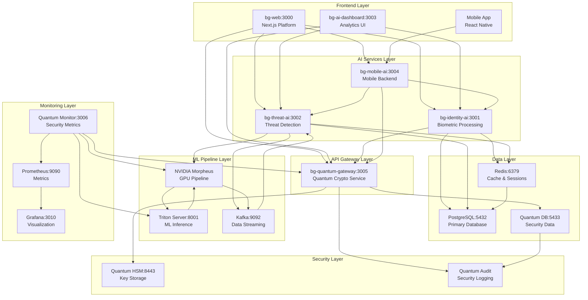
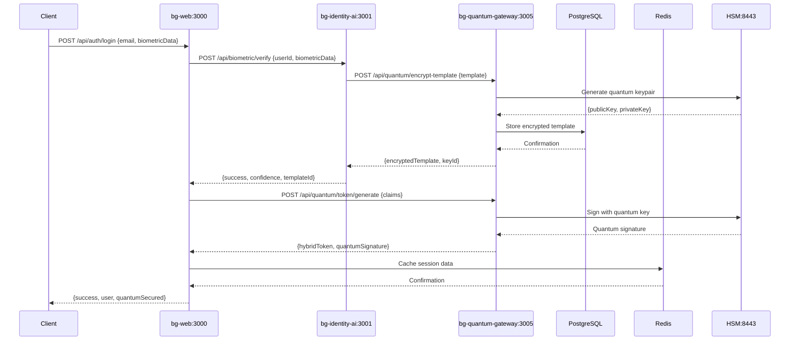
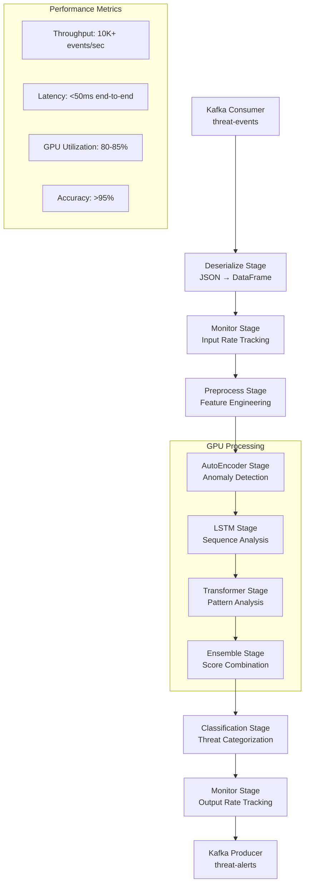

# BehaviorGuard System Data Flow Architecture
## Complete Static & Dynamic Structure with I/O Specifications

---

## **📋 Executive Summary**

This document provides a comprehensive technical blueprint of data flow, I/O operations, and component interactions across the entire BehaviorGuard quantum-secure AI platform. It covers both static architecture (component relationships) and dynamic behavior (runtime data flow) with precise specifications for every interaction point.

---

## **🏗️ Static System Architecture**

### **Component Hierarchy & Relationships**


### **Port & Protocol Matrix**
```yaml
Service Ports & Protocols:
  bg-web (3000):
    - HTTP/HTTPS: Client requests, API calls
    - WebSocket: Real-time updates from dashboard
    
  bg-identity-ai (3001):
    - HTTP/HTTPS: Biometric processing APIs
    - TCP: Database connections (PostgreSQL:5432)
    - TCP: Cache connections (Redis:6379)
    - HTTP: Quantum gateway calls (3005)
    
  bg-threat-ai (3002):
    - HTTP/HTTPS: Threat detection APIs
    - WebSocket: Real-time threat alerts
    - TCP: Kafka producer (9092)
    - TCP: Database/Cache connections
    - HTTP: Morpheus pipeline calls (8889)
    
  bg-ai-dashboard (3003):
    - HTTP/HTTPS: Dashboard API
    - WebSocket: Real-time data streaming
    - HTTP: Service health checks (3001,3002,3004,3005)
    
  bg-mobile-ai (3004):
    - HTTP/HTTPS: Mobile API endpoints
    - HTTP: Identity AI calls (3001)
    - HTTP: Threat AI calls (3002)
    - HTTP: Quantum gateway calls (3005)
    
  bg-quantum-gateway (3005):
    - HTTP/HTTPS: Quantum crypto operations
    - TCP: Quantum database (5433)
    - TCP: Quantum cache (6380)
    - HTTPS: HSM integration (8443)
    
  Triton Server (8001):
    - GRPC: ML model inference
    - HTTP: Health checks and metrics (8002)
    
  Kafka (9092):
    - TCP: Kafka protocol for producers/consumers
    - TCP: Zookeeper coordination (2181)
    
  HSM (8443):
    - HTTPS: Secure key operations
    - TCP: Audit logging
```

---

## **🔄 Dynamic Data Flow Specifications**

### **1. User Authentication Flow**

#### **Input/Output Chain:**
```typescript
// Authentication Data Flow Specification
interface AuthenticationFlow {
  // Step 1: Initial Request
  input: {
    endpoint: "POST /api/auth/login",
    headers: {
      "Content-Type": "application/json",
      "User-Agent": string,
      "X-Device-ID": string
    },
    body: {
      email: string,
      password?: string,
      biometricData?: string, // base64 encoded
      deviceFingerprint: DeviceFingerprint
    }
  },
  
  // Step 2: bg-web → bg-identity-ai
  identityProcessing: {
    endpoint: "POST http://bg-identity-ai:3001/api/biometric/verify",
    payload: {
      userId: string,
      biometricData: string,
      biometricType: "face" | "fingerprint",
      deviceId: string,
      timestamp: string
    },
    response: {
      success: boolean,
      confidence: number,
      templateId: string,
      quantumEncrypted: boolean
    }
  },
  
  // Step 3: bg-identity-ai → bg-quantum-gateway
  quantumEncryption: {
    endpoint: "POST http://bg-quantum-gateway:3005/api/quantum/encrypt-template",
    payload: {
      userId: string,
      biometricTemplate: Buffer,
      algorithm: "Kyber768"
    },
    response: {
      encryptedTemplate: string,
      publicKey: string,
      keyId: string,
      securityLevel: "NIST-L3"
    }
  },
  
  // Step 4: bg-quantum-gateway → PostgreSQL
  databaseStorage: {
    query: "INSERT INTO quantum_biometric_templates",
    parameters: {
      user_id: string,
      encrypted_template: string,
      key_id: string,
      created_at: timestamp,
      algorithm: string
    }
  },
  
  // Step 5: Token Generation
  tokenGeneration: {
    endpoint: "POST http://bg-quantum-gateway:3005/api/quantum/token/generate",
    payload: {
      userId: string,
      claims: UserClaims,
      hybridMode: true
    },
    response: {
      hybridToken: string,
      classicalToken: string,
      quantumSignature: QuantumSignature,
      expiresIn: number
    }
  },
  
  // Step 6: Final Response
  output: {
    status: 200,
    headers: {
      "Set-Cookie": "auth_token=hybridToken; Secure; HttpOnly",
      "X-Quantum-Secured": "true"
    },
    body: {
      success: true,
      user: UserProfile,
      quantumSecured: true,
      securityLevel: "NIST-L3"
    }
  }
}
```

#### **Data Flow Diagram:**


### **2. Real-time Threat Detection Flow**

#### **Input/Output Chain:**
```typescript
// Threat Detection Data Flow Specification
interface ThreatDetectionFlow {
  // Step 1: User Activity Capture
  activityCapture: {
    source: "User behavior monitoring",
    data: {
      userId: string,
      sessionId: string,
      timestamp: string,
      behavioralMetrics: {
        mouseDynamics: MousePattern[],
        keystrokeDynamics: KeystrokePattern[],
        navigationPattern: NavigationData,
        sessionDuration: number,
        apiCallFrequency: number,
        dataAccessPatterns: AccessPattern[]
      },
      contextualData: {
        ipAddress: string,
        userAgent: string,
        location: GeoLocation,
        deviceFingerprint: string,
        networkFingerprint: string
      }
    }
  },
  
  // Step 2: bg-web → bg-threat-ai
  threatAnalysisRequest: {
    endpoint: "POST http://bg-threat-ai:3002/api/threat/analyze-realtime",
    payload: {
      userId: string,
      eventData: BehavioralEvent,
      timestamp: string,
      correlationId: string
    },
    response: {
      eventId: string,
      preliminaryRisk: number,
      processingStatus: "queued_for_morpheus"
    }
  },
  
  // Step 3: bg-threat-ai → Kafka
  kafkaProduction: {
    topic: "threat-events",
    partition: "computed_by_user_hash",
    message: {
      key: string, // userId
      value: {
        user_id: string,
        timestamp: string,
        source: "behavioral",
        // ML Feature Vector (15 dimensions)
        user_behavior_score: number,
        network_activity: number,
        authentication_patterns: number,
        biometric_confidence: number,
        threat_indicators: number,
        session_duration: number,
        device_fingerprint_hash: number,
        location_consistency: number,
        api_usage_anomaly: number,
        data_access_risk: number,
        typing_pattern_deviation: number,
        mouse_dynamic_variance: number,
        navigation_anomaly: number,
        privilege_escalation_attempt: number,
        failed_auth_ratio: number
      },
      headers: {
        "correlation-id": string,
        "user-id": string,
        "service": "bg-threat-ai"
      }
    }
  },
  
  // Step 4: Kafka → NVIDIA Morpheus
  morpheusProcessing: {
    input: {
      source: "Kafka consumer: threat-events topic",
      batchSize: 1024,
      processingWindow: "100ms"
    },
    pipeline: {
      preprocessing: {
        deserialization: "JSON → Tensor",
        normalization: "StandardScaler",
        featureEngineering: "15D → 256D feature vector"
      },
      aiInference: {
        models: [
          {
            name: "anomaly-detection",
            type: "AutoEncoder",
            input: "256D feature vector",
            output: "reconstruction_error: float"
          },
          {
            name: "sequence-analysis", 
            type: "LSTM",
            input: "50-step sequence",
            output: "threat_probability: float"
          },
          {
            name: "behavioral-transformer",
            type: "Transformer",
            input: "behavioral_sequence",
            output: "pattern_anomaly: float"
          }
        ]
      },
      postprocessing: {
        threatScoring: {
          algorithm: "Weighted ensemble",
          weights: {
            anomaly_score: 0.4,
            sequence_threat: 0.3,
            pattern_anomaly: 0.3
          },
          output: "final_threat_score: 0.0-1.0"
        },
        classification: {
          thresholds: {
            normal: "< 0.3",
            suspicious: "0.3-0.7", 
            threat: "0.7-0.9",
            critical: "> 0.9"
          }
        }
      }
    },
    output: {
      topic: "threat-alerts",
      message: {
        event_id: string,
        user_id: string,
        threat_score: number,
        threat_level: "normal" | "suspicious" | "threat" | "critical",
        anomaly_score: number,
        sequence_threat_score: number,
        pattern_anomaly_score: number,
        ml_confidence: number,
        processing_time_ms: number,
        model_versions: ModelVersion[],
        recommendations: string[]
      }
    }
  },
  
  // Step 5: Kafka → bg-threat-ai (Alert Consumption)
  alertConsumption: {
    consumer: {
      topic: "threat-alerts",
      groupId: "bg-threat-ai-consumer",
      autoOffsetReset: "latest"
    },
    processing: {
      endpoint: "Internal threat processing",
      logic: {
        storeThreatEvent: "PostgreSQL insertion",
        cacheUpdate: "Redis threat cache update",
        realTimeAlert: "WebSocket broadcast",
        correlationUpdate: "Update user risk profile"
      }
    }
  },
  
  // Step 6: Real-time Alert Broadcast
  realtimeAlert: {
    webSocket: {
      endpoint: "ws://bg-threat-ai:3002/ws",
      message: {
        type: "threat_alert",
        data: {
          userId: string,
          threatLevel: string,
          threatScore: number,
          timestamp: string,
          recommendations: string[],
          correlationId: string
        }
      }
    },
    dashboard: {
      endpoint: "WebSocket to bg-ai-dashboard:3003",
      subscribers: ["security_operators", "system_admins"],
      alertLevels: {
        critical: "Immediate notification",
        threat: "High priority alert", 
        suspicious: "Monitoring queue"
      }
    }
  }
}
```

#### **Morpheus Pipeline Data Flow:**


### **3. Quantum Key Management Flow**

#### **Input/Output Chain:**
```typescript
// Quantum Key Management Flow Specification
interface QuantumKeyManagementFlow {
  // Step 1: Key Generation Request
  keyGenerationRequest: {
    endpoint: "POST http://bg-quantum-gateway:3005/api/quantum/keygen",
    headers: {
      "Authorization": "Bearer quantum_admin_token",
      "X-Organization-ID": string,
      "Content-Type": "application/json"
    },
    payload: {
      keyType: "master" | "service" | "device",
      algorithm: "Kyber768" | "Dilithium3",
      purpose: "encryption" | "signing" | "both",
      organizationId: string,
      serviceId?: string,
      deviceId?: string,
      securityLevel: "NIST-L1" | "NIST-L3" | "NIST-L5"
    }
  },
  
  // Step 2: bg-quantum-gateway → HSM
  hsmKeyGeneration: {
    endpoint: "HTTPS POST https://hsm:8443/api/keygen",
    authentication: "Mutual TLS + HSM Token",
    payload: {
      keyType: string,
      algorithm: string,
      entropySource: "QRNG",
      keySize: number,
      organizationId: string
    },
    response: {
      keyId: string,
      publicKey: string,
      keyHandle: string, // HSM internal reference
      entropy: string,
      generationTime: string
    }
  },
  
  // Step 3: Quantum Algorithm Processing
  quantumProcessing: {
    library: "liboqs-node",
    operations: {
      kemKeyGeneration: {
        algorithm: "Kyber768",
        input: {
          entropy: Buffer, // from HSM
          additionalData: string
        },
        output: {
          publicKey: Buffer, // 1184 bytes
          privateKey: Buffer // 2400 bytes
        },
        performance: {
          operationTime: "<5ms",
          memoryUsage: "~4KB"
        }
      },
      signatureKeyGeneration: {
        algorithm: "Dilithium3", 
        input: {
          entropy: Buffer,
          additionalData: string
        },
        output: {
          publicKey: Buffer, // 1952 bytes
          privateKey: Buffer // 4000 bytes
        },
        performance: {
          operationTime: "<10ms",
          memoryUsage: "~8KB"
        }
      }
    }
  },
  
  // Step 4: Key Storage & Backup
  keyStorage: {
    primary: {
      destination: "HSM secure partition",
      encryption: "AES-256-GCM with HSM master key",
      redundancy: "Triple replication across HSM modules"
    },
    database: {
      table: "quantum_keys",
      schema: {
        key_id: "UUID PRIMARY KEY",
        organization_id: "UUID NOT NULL",
        key_type: "ENUM('master','service','device')",
        algorithm: "VARCHAR(50)",
        public_key: "BYTEA",
        key_handle: "VARCHAR(255)", // HSM reference
        security_level: "VARCHAR(10)",
        created_at: "TIMESTAMP",
        expires_at: "TIMESTAMP",
        status: "ENUM('active','rotated','revoked')",
        audit_trail: "JSONB"
      },
      indexes: [
        "idx_quantum_keys_org_type",
        "idx_quantum_keys_status_expires",
        "idx_quantum_keys_key_handle"
      ]
    },
    cache: {
      destination: "Redis quantum cache (port 6380)",
      structure: {
        key: "quantum:key:{keyId}",
        value: {
          keyId: string,
          publicKey: string, // base64 encoded
          algorithm: string,
          expiresAt: number,
          securityLevel: string
        },
        ttl: 3600 // 1 hour
      }
    }
  },
  
  // Step 5: Audit Logging
  auditLogging: {
    destination: "Quantum audit database",
    schema: {
      audit_id: "UUID PRIMARY KEY",
      operation: "ENUM('keygen','encrypt','decrypt','sign','verify')",
      key_id: "UUID",
      user_id: "UUID",
      organization_id: "UUID", 
      timestamp: "TIMESTAMP",
      source_ip: "INET",
      correlation_id: "UUID",
      operation_data: "JSONB",
      result: "ENUM('success','failure','partial')",
      error_details: "TEXT"
    },
    realTimeMonitoring: {
      endpoint: "WebSocket to quantum monitor",
      alertThresholds: {
        keyGenFailures: "> 5 per minute",
        unusualKeyAccess: "Outside business hours",
        multipleKeyRequests: "> 100 per hour per org"
      }
    }
  },
  
  // Step 6: Response Formation
  response: {
    success: {
      status: 201,
      headers: {
        "X-Key-ID": string,
        "X-Security-Level": string,
        "X-Correlation-ID": string
      },
      body: {
        keyId: string,
        publicKey: string, // base64 encoded
        algorithm: string,
        securityLevel: string,
        expiresAt: string,
        keyHandle: string,
        quantumSecured: true
      }
    },
    failure: {
      status: 400 | 500,
      body: {
        error: string,
        errorCode: string,
        correlationId: string,
        suggestedAction: string
      }
    }
  }
}
```

### **4. Mobile Biometric Capture Flow**

#### **Input/Output Chain:**
```typescript
// Mobile Biometric Capture Flow Specification
interface MobileBiometricFlow {
  // Step 1: Mobile App → bg-mobile-ai
  biometricRequest: {
    endpoint: "POST http://bg-mobile-ai:3004/api/mobile/biometric/capture",
    headers: {
      "Authorization": "Bearer mobile_device_token",
      "X-Device-ID": string,
      "X-Biometric-Type": "face" | "fingerprint",
      "Content-Type": "application/json"
    },
    payload: {
      userId: string,
      deviceId: string,
      biometricType: "face" | "fingerprint",
      biometricData: string, // base64 encoded image
      captureMetadata: {
        timestamp: string,
        cameraResolution: string,
        lightingConditions: number,
        deviceOrientation: string,
        biometricQuality: number
      },
      quantumSecured: boolean
    }
  },
  
  // Step 2: bg-mobile-ai → bg-identity-ai
  identityProcessing: {
    endpoint: "POST http://bg-identity-ai:3001/api/biometric/process-mobile",
    payload: {
      userId: string,
      biometricData: string,
      biometricType: string,
      deviceId: string,
      processingMode: "enrollment" | "verification",
      qualityThreshold: 0.8
    },
    processing: {
      imagePreprocessing: {
        steps: [
          "Noise reduction",
          "Contrast enhancement", 
          "Feature extraction",
          "Quality assessment"
        ],
        output: {
          processedImage: Buffer,
          qualityScore: number,
          featureVector: number[]
        }
      },
      biometricExtraction: {
        faceProcessing: {
          library: "MediaPipe / OpenCV",
          features: [
            "68 facial landmarks",
            "Face encoding (128D vector)",
            "Liveness detection score",
            "Age/gender estimation"
          ]
        },
        fingerprintProcessing: {
          library: "Custom minutiae extractor",
          features: [
            "Minutiae points (x,y,angle,type)",
            "Ridge patterns",
            "Core/delta points",
            "Quality metrics"
          ]
        }
      }
    },
    response: {
      success: boolean,
      biometricTemplate: BiometricTemplate,
      qualityScore: number,
      livenessScore?: number,
      processingTime: number
    }
  },
  
  // Step 3: bg-identity-ai → bg-quantum-gateway
  quantumEncryption: {
    endpoint: "POST http://bg-quantum-gateway:3005/api/quantum/encrypt-biometric",
    payload: {
      userId: string,
      deviceId: string,
      biometricTemplate: BiometricTemplate,
      algorithm: "Kyber768",
      securityLevel: "NIST-L3"
    },
    cryptoOperations: {
      keyGeneration: {
        algorithm: "Kyber768",
        purpose: "biometric_encryption",
        deviceBinding: true
      },
      encryption: {
        process: [
          "Generate ephemeral keypair",
          "Encapsulate shared secret",
          "AES-256-GCM encrypt template",
          "Store ciphertext + public key"
        ],
        output: {
          encryptedTemplate: string,
          publicKey: string,
          ciphertext: string,
          authTag: string
        }
      }
    },
    response: {
      encryptedBiometric: QuantumEncryptedBiometric,
      keyId: string,
      encryptionAlgorithm: string,
      quantumSecured: true
    }
  },
  
  // Step 4: Database Storage
  databaseOperations: {
    biometricStorage: {
      table: "encrypted_biometric_templates",
      operation: "INSERT",
      data: {
        user_id: string,
        device_id: string,
        biometric_type: string,
        encrypted_template: string,
        quantum_key_id: string,
        quality_score: number,
        created_at: timestamp,
        expires_at: timestamp,
        algorithm: string,
        security_level: string
      }
    },
    deviceRegistration: {
      table: "quantum_mobile_devices", 
      operation: "UPSERT",
      data: {
        device_id: string,
        user_id: string,
        quantum_key_id: string,
        biometric_capabilities: string[],
        last_activity: timestamp,
        trust_score: number,
        quantum_enabled: boolean
      }
    }
  },
  
  // Step 5: Mobile Response
  mobileResponse: {
    success: {
      status: 200,
      body: {
        success: true,
        biometricId: string,
        quantumSecured: true,
        securityLevel: "NIST-L3",
        deviceRegistered: boolean,
        qualityScore: number,
        nextAction: "verification_ready" | "additional_capture_needed"
      }
    },
    localStorage: {
      secureStore: {
        key: "biometric_registration",
        value: {
          biometricId: string,
          deviceId: string,
          quantumKeyId: string,
          registrationTime: string,
          expiresAt: string
        },
        options: {
          requireAuthentication: true,
          authenticationPrompt: "Access biometric data"
        }
      }
    }
  }
}
```

---

## **📊 Data Structure Specifications**

### **Database Schema Definitions**

#### **PostgreSQL Main Database (port 5432)**
```sql
-- Core user and service tables
CREATE SCHEMA behaviorguard;
CREATE SCHEMA ai_services;
CREATE SCHEMA monitoring;

-- Users and authentication
CREATE TABLE behaviorguard.users (
    user_id UUID PRIMARY KEY DEFAULT gen_random_uuid(),
    email VARCHAR(255) UNIQUE NOT NULL,
    password_hash VARCHAR(255),
    quantum_enabled BOOLEAN DEFAULT false,
    created_at TIMESTAMP DEFAULT CURRENT_TIMESTAMP,
    updated_at TIMESTAMP DEFAULT CURRENT_TIMESTAMP,
    status user_status DEFAULT 'active'
);

-- Biometric templates (encrypted)
CREATE TABLE ai_services.biometric_templates (
    template_id UUID PRIMARY KEY DEFAULT gen_random_uuid(),
    user_id UUID REFERENCES behaviorguard.users(user_id),
    biometric_type biometric_type_enum NOT NULL,
    encrypted_template BYTEA NOT NULL,
    quantum_key_id UUID NOT NULL,
    quality_score DECIMAL(3,2),
    device_id VARCHAR(255),
    created_at TIMESTAMP DEFAULT CURRENT_TIMESTAMP,
    expires_at TIMESTAMP,
    algorithm VARCHAR(50) DEFAULT 'Kyber768',
    security_level VARCHAR(10) DEFAULT 'NIST-L3'
);

-- Threat detection events  
CREATE TABLE ai_services.threat_events (
    event_id UUID PRIMARY KEY DEFAULT gen_random_uuid(),
    user_id UUID REFERENCES behaviorguard.users(user_id),
    session_id UUID,
    threat_score DECIMAL(4,3) NOT NULL,
    threat_level threat_level_enum NOT NULL,
    anomaly_score DECIMAL(4,3),
    sequence_threat_score DECIMAL(4,3),
    pattern_anomaly_score DECIMAL(4,3),
    ml_confidence DECIMAL(4,3),
    processing_time_ms INTEGER,
    morpheus_pipeline_version VARCHAR(50),
    event_data JSONB,
    recommendations TEXT[],
    correlation_id UUID,
    created_at TIMESTAMP DEFAULT CURRENT_TIMESTAMP,
    processed_at TIMESTAMP
);

-- Behavioral profiles
CREATE TABLE ai_services.behavioral_profiles (
    profile_id UUID PRIMARY KEY DEFAULT gen_random_uuid(),
    user_id UUID REFERENCES behaviorguard.users(user_id),
    baseline_behavior JSONB NOT NULL,
    risk_score DECIMAL(4,3) DEFAULT 0.5,
    last_analysis TIMESTAMP,
    pattern_fingerprint VARCHAR(255),
    anomaly_threshold DECIMAL(4,3) DEFAULT 0.7,
    created_at TIMESTAMP DEFAULT CURRENT_TIMESTAMP,
    updated_at TIMESTAMP DEFAULT CURRENT_TIMESTAMP
);

-- Performance indexes
CREATE INDEX idx_biometric_templates_user_type ON ai_services.biometric_templates(user_id, biometric_type);
CREATE INDEX idx_threat_events_user_score ON ai_services.threat_events(user_id, threat_score DESC);
CREATE INDEX idx_threat_events_timestamp ON ai_services.threat_events(created_at DESC);
CREATE INDEX idx_behavioral_profiles_risk ON ai_services.behavioral_profiles(risk_score DESC);
```

#### **Quantum Security Database (port 5433)**
```sql
-- Quantum-specific security database
CREATE SCHEMA quantum_security;
CREATE SCHEMA quantum_audit;
CREATE SCHEMA quantum_keys;

-- Quantum key management
CREATE TABLE quantum_keys.quantum_key_store (
    key_id UUID PRIMARY KEY DEFAULT gen_random_uuid(),
    organization_id UUID NOT NULL,
    key_type quantum_key_type_enum NOT NULL,
    algorithm VARCHAR(50) NOT NULL,
    public_key BYTEA NOT NULL,
    key_handle VARCHAR(255) NOT NULL, -- HSM reference
    security_level VARCHAR(10) NOT NULL,
    purpose key_purpose_enum NOT NULL,
    parent_key_id UUID REFERENCES quantum_keys.quantum_key_store(key_id),
    created_at TIMESTAMP DEFAULT CURRENT_TIMESTAMP,
    expires_at TIMESTAMP NOT NULL,
    rotated_at TIMESTAMP,
    status key_status_enum DEFAULT 'active',
    metadata JSONB
);

-- Quantum operations audit trail
CREATE TABLE quantum_audit.quantum_operations_log (
    audit_id UUID PRIMARY KEY DEFAULT gen_random_uuid(),
    operation quantum_operation_enum NOT NULL,
    key_id UUID,
    user_id UUID,
    organization_id UUID,
    service_id VARCHAR(100),
    operation_timestamp TIMESTAMP DEFAULT CURRENT_TIMESTAMP,
    source_ip INET,
    user_agent TEXT,
    correlation_id UUID,
    operation_data JSONB,
    result operation_result_enum NOT NULL,
    processing_time_ms INTEGER,
    error_details TEXT,
    hsm_operation_id VARCHAR(255)
);

-- Quantum security events
CREATE TABLE quantum_security.security_events (
    event_id UUID PRIMARY KEY DEFAULT gen_random_uuid(),
    event_type security_event_type_enum NOT NULL,
    severity severity_level_enum NOT NULL,
    key_id UUID,
    user_id UUID,
    organization_id UUID,
    event_timestamp TIMESTAMP DEFAULT CURRENT_TIMESTAMP,
    event_data JSONB NOT NULL,
    response_action TEXT,
    resolved_at TIMESTAMP,
    correlation_id UUID
);

-- High-performance indexes for quantum operations
CREATE INDEX idx_quantum_keys_org_type_status ON quantum_keys.quantum_key_store(organization_id, key_type, status);
CREATE INDEX idx_quantum_keys_expires_at ON quantum_keys.quantum_key_store(expires_at) WHERE status = 'active';
CREATE INDEX idx_quantum_audit_timestamp ON quantum_audit.quantum_operations_log(operation_timestamp DESC);
CREATE INDEX idx_quantum_audit_correlation ON quantum_audit.quantum_operations_log(correlation_id);
CREATE INDEX idx_security_events_severity_timestamp ON quantum_security.security_events(severity, event_timestamp DESC);
```

### **Redis Data Structures**

#### **Main Redis Instance (port 6379)**
```redis
# Session management
SET "session:{sessionId}" '{
  "userId": "uuid",
  "deviceId": "string", 
  "loginTime": "timestamp",
  "lastActivity": "timestamp",
  "quantumSecured": boolean,
  "hybridToken": "base64_encoded_token",
  "riskScore": number,
  "biometricVerified": boolean
}' EX 3600

# User behavioral cache
HSET "behavior:{userId}" 
  "baselineScore" "0.3"
  "currentRisk" "0.2" 
  "lastThreatScore" "0.1"
  "sessionCount" "5"
  "avgSessionDuration" "1800"
  "lastAnomalyTime" "timestamp"

# Threat detection cache
ZADD "threats:recent" timestamp "threatEventJson"
ZADD "threats:high_risk" threatScore "{userId}:{eventId}"

# Rate limiting
INCR "ratelimit:{userId}:{endpoint}" EX 60
INCR "ratelimit:global:{endpoint}" EX 60

# Real-time metrics
LPUSH "metrics:morpheus:throughput" '{"timestamp": ts, "events_per_sec": 8500}'
LTRIM "metrics:morpheus:throughput" 0 999 # Keep last 1000 entries
```

#### **Quantum Redis Instance (port 6380)**
```redis
# Quantum key cache
HSET "quantum:key:{keyId}"
  "publicKey" "base64_encoded_key"
  "algorithm" "Kyber768" 
  "securityLevel" "NIST-L3"
  "expiresAt" "timestamp"
  "organizationId" "uuid"
  "keyType" "service|device|master"

# Quantum operation metrics
INCR "quantum:ops:kem:count" EX 300
INCR "quantum:ops:sig:count" EX 300
LPUSH "quantum:ops:latency" '{"operation": "keygen", "latency_ms": 5}'

# HSM connection pool
SET "hsm:connection:{connectionId}" "active" EX 1800
HSET "hsm:stats" 
  "active_connections" "5"
  "total_operations" "15847"
  "error_rate" "0.001"
```

### **Kafka Topic Specifications**

#### **Topic: threat-events**
```yaml
Configuration:
  partitions: 8
  replication_factor: 1
  retention_ms: 86400000  # 24 hours
  compression_type: lz4
  max_message_bytes: 1048576  # 1MB

Message Schema:
  key: userId (string)
  value:
    user_id: string
    timestamp: string (ISO 8601)
    source: enum["behavioral", "network", "biometric", "authentication"]
    correlation_id: string
    
    # ML Feature Vector (15 dimensions)
    user_behavior_score: float (0.0-1.0)
    network_activity: float (0.0-1.0)
    authentication_patterns: float (0.0-1.0)
    biometric_confidence: float (0.0-1.0)
    threat_indicators: integer (0-10)
    session_duration: integer (seconds)
    device_fingerprint_hash: float (0.0-1.0)
    location_consistency: float (0.0-1.0)
    api_usage_anomaly: float (0.0-1.0)
    data_access_risk: float (0.0-1.0)
    typing_pattern_deviation: float (0.0-1.0)
    mouse_dynamic_variance: float (0.0-1.0)
    navigation_anomaly: float (0.0-1.0)
    privilege_escalation_attempt: float (0.0-1.0)
    failed_auth_ratio: float (0.0-1.0)
    
  headers:
    correlation-id: string
    user-id: string
    service: string
    timestamp: string

Producers:
  - bg-threat-ai:3002
  
Consumers:
  - morpheus-threat-detection (GPU pipeline)
```

#### **Topic: threat-alerts**
```yaml
Configuration:
  partitions: 8
  replication_factor: 1
  retention_ms: 604800000  # 7 days
  compression_type: lz4

Message Schema:
  key: eventId (string)
  value:
    event_id: string
    user_id: string  
    threat_score: float (0.0-1.0)
    threat_level: enum["normal", "suspicious", "threat", "critical"]
    anomaly_score: float (0.0-1.0)
    sequence_threat_score: float (0.0-1.0)
    pattern_anomaly_score: float (0.0-1.0)
    ml_confidence: float (0.0-1.0)
    processing_time_ms: integer
    model_versions:
      - name: string
        version: string
        accuracy: float
    recommendations: array[string]
    correlation_id: string
    timestamp: string
    
  headers:
    alert-level: string
    user-id: string
    correlation-id: string
    processing-node: string

Producers:
  - morpheus-threat-detection
  
Consumers:
  - bg-threat-ai:3002
  - bg-ai-dashboard:3003
```

---

## **⚡ Performance & Monitoring Specifications**

### **System Performance Metrics**

#### **Throughput Specifications**
```yaml
Service Throughput Targets:
  bg-identity-ai:
    biometric_verifications: "1000 verifications/minute"
    document_authentications: "500 authentications/minute"
    quantum_encryptions: "2000 operations/minute"
    
  bg-threat-ai:
    threat_analysis_requests: "10000 requests/minute"
    morpheus_event_processing: "10000+ events/second"
    realtime_alerts: "1000 alerts/minute"
    
  bg-quantum-gateway:
    key_generations: "100 keys/minute"
    quantum_operations: "5000 operations/minute"
    token_generations: "2000 tokens/minute"
    
  bg-mobile-ai:
    mobile_authentications: "2000 auths/minute"
    biometric_captures: "1000 captures/minute"
    
  morpheus-pipeline:
    event_processing: "10000+ events/second"
    ml_inference_latency: "<10ms per batch"
    end_to_end_latency: "<50ms"
```

#### **Resource Utilization Targets**
```yaml
CPU Utilization:
  bg-identity-ai: "40-60%"
  bg-threat-ai: "30-50%" 
  bg-quantum-gateway: "20-40%"
  bg-mobile-ai: "30-50%"
  morpheus-gpu-pipeline: "80-90% GPU, 40-60% CPU"

Memory Usage:
  bg-identity-ai: "2-4 GB"
  bg-threat-ai: "4-8 GB"
  bg-quantum-gateway: "1-2 GB" 
  bg-mobile-ai: "2-4 GB"
  morpheus-pipeline: "12-16 GB GPU, 8-12 GB RAM"

Network I/O:
  internal_service_calls: "100-500 MB/hour per service"
  kafka_throughput: "1-5 GB/hour"
  database_traffic: "500 MB - 2 GB/hour"
  websocket_streams: "50-200 MB/hour"
```

### **Health Check & Monitoring Endpoints**

#### **Service Health Checks**
```typescript
// Health check response specification
interface HealthCheckResponse {
  service: string;
  status: "healthy" | "degraded" | "unhealthy";
  timestamp: string;
  version: string;
  uptime: number; // seconds
  
  dependencies: {
    database: {
      status: "connected" | "disconnected" | "slow";
      latency_ms: number;
      connection_pool: {
        active: number;
        idle: number;
        total: number;
      };
    };
    
    redis: {
      status: "connected" | "disconnected" | "slow";
      latency_ms: number;
      memory_usage: string;
    };
    
    external_services: {
      [serviceName: string]: {
        status: "reachable" | "unreachable" | "timeout";
        latency_ms: number;
        last_check: string;
      };
    };
  };
  
  performance: {
    requests_per_minute: number;
    average_response_time: number;
    error_rate_percent: number;
    cpu_usage_percent: number;
    memory_usage_mb: number;
  };
  
  quantum_specific?: {
    quantum_operations_per_minute: number;
    hsm_connection_status: "connected" | "disconnected";
    key_cache_hit_rate: number;
    encryption_success_rate: number;
  };
  
  morpheus_specific?: {
    gpu_utilization_percent: number;
    events_processed_per_second: number;
    ml_inference_latency_ms: number;
    pipeline_status: "running" | "stopped" | "error";
    model_accuracy_percent: number;
  };
}
```

#### **Monitoring WebSocket Streams**
```typescript
// Real-time monitoring data structures
interface MonitoringWebSocketMessage {
  type: "metrics" | "alert" | "status_change" | "performance_update";
  timestamp: string;
  correlation_id: string;
  
  data: {
    service: string;
    metrics?: {
      throughput: number;
      latency: number;
      error_rate: number;
      resource_usage: ResourceUsage;
    };
    
    alert?: {
      level: "info" | "warning" | "error" | "critical";
      message: string;
      affected_services: string[];
      recommended_action: string;
    };
    
    status_change?: {
      previous_status: string;
      current_status: string;
      reason: string;
    };
    
    performance_update?: {
      component: string;
      metric_name: string;
      current_value: number;
      threshold: number;
      trend: "improving" | "degrading" | "stable";
    };
  };
}
```

---

## **🔄 Error Handling & Recovery Flows**

### **Error Propagation Chain**
```typescript
// Comprehensive error handling specification
interface ErrorHandlingFlow {
  error_detection: {
    sources: [
      "Service health checks",
      "Database connection failures", 
      "Quantum operation failures",
      "ML pipeline errors",
      "Authentication failures",
      "Rate limit violations"
    ];
    
    detection_methods: {
      active_monitoring: "Health check endpoints every 30s";
      passive_monitoring: "Error logging and aggregation";
      user_reported: "Error feedback from frontend";
      automated_testing: "Synthetic transaction monitoring";
    };
  };
  
  error_classification: {
    severity_levels: {
      critical: {
        examples: ["HSM disconnection", "Database cluster failure", "GPU pipeline crash"];
        response_time: "<1 minute";
        escalation: "Immediate alert to on-call engineer";
      };
      
      high: {
        examples: ["Service degradation", "High error rates", "Quantum key rotation failure"];
        response_time: "<5 minutes";
        escalation: "Alert to monitoring team";
      };
      
      medium: {
        examples: ["Individual request failures", "Temporary cache miss", "Minor performance degradation"];
        response_time: "<15 minutes";
        escalation: "Log aggregation and trending";
      };
      
      low: {
        examples: ["User input validation errors", "Rate limiting", "Expected authentication failures"];
        response_time: "Best effort";
        escalation: "Standard logging";
      };
    };
  };
  
  recovery_procedures: {
    automatic_recovery: {
      service_restart: {
        triggers: ["Health check failures > 3 consecutive"];
        procedure: [
          "Graceful shutdown attempt (30s timeout)",
          "Force kill if necessary",
          "Container restart via orchestrator",
          "Health check validation",
          "Traffic restoration"
        ];
        rollback_conditions: ["Recovery failure after 3 attempts"];
      };
      
      circuit_breaker: {
        triggers: ["Error rate > 50% over 1 minute"];
        states: ["closed", "open", "half_open"];
        recovery_test_frequency: "Every 60 seconds";
      };
      
      database_failover: {
        triggers: ["Primary DB connection failure"];
        procedure: [
          "Switch to read replica",
          "Queue write operations",
          "Attempt primary recovery",
          "Sync queued operations"
        ];
      };
    };
    
    manual_recovery: {
      service_replacement: {
        procedure: [
          "Deploy new service instance",
          "Run health checks",
          "Gradual traffic migration",
          "Monitor performance",
          "Retire old instance"
        ];
      };
      
      data_recovery: {
        quantum_key_recovery: [
          "Access HSM backup partition",
          "Reconstruct keys from shares",
          "Validate key integrity",
          "Update key cache",
          "Resume quantum operations"
        ];
        
        threat_data_recovery: [
          "Restore from PostgreSQL backup",
          "Replay Kafka messages", 
          "Rebuild user behavior profiles",
          "Validate ML model state"
        ];
      };
    };
  };
}
```

This comprehensive document provides the complete technical blueprint for understanding exactly how data flows through every component of the BehaviorGuard quantum-secure AI platform, including all I/O operations, data transformations, and system interactions at runtime.