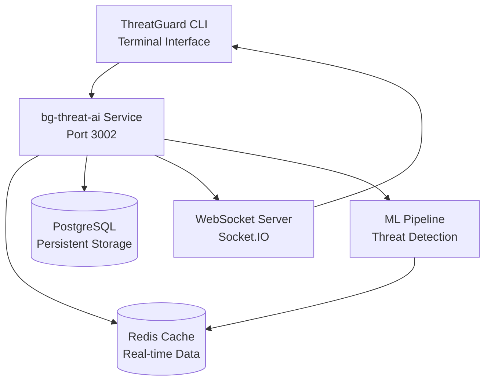

# ThreatGuard AI Architecture
## Console-First Cybersecurity Platform

**Target Audience:** AI Engineers, Security Architects, and Platform Developers  
**Last Updated:** August 2025

---

## Executive Summary

ThreatGuard is a **console-first cybersecurity platform** that combines real-time threat detection, behavioral analysis, and advanced AI/ML algorithms to provide enterprise-grade security monitoring through a professional CLI interface. The platform targets security analysts and SOC teams with a focus on high-performance, real-time threat intelligence and sub-100ms response times.

### Key Architectural Principles
- **Console-First Design**: Terminal-native interface optimized for security professionals
- **Real-time Processing**: Sub-100ms API responses with WebSocket streaming for live updates  
- **AI-Driven Analysis**: Machine learning models for threat detection and behavioral analysis
- **Enterprise Security**: JWT authentication, audit logging, and compliance frameworks

---

## System Architecture Overview

### Core Service: bg-threat-ai
**Port:** 3002  
**Framework:** Node.js/Express with TypeScript  
**Performance:** <100ms API response, <50ms WebSocket latency  
**Dependencies:** Redis (caching), PostgreSQL (persistence), Socket.IO (real-time)



### Client Interfaces

#### 1. ThreatGuard CLI (Primary Interface)
- **Interactive Dashboard**: Real-time security metrics and threat visualization
- **Command Interface**: Full-featured command execution with history and auto-completion
- **Live Event Stream**: Real-time security event monitoring with filtering
- **WebSocket Integration**: Sub-50ms latency for live threat feeds

#### 2. Web Interface (Minimal)
- **Admin Panel**: Service configuration and management
- **Documentation**: API documentation and system status
- **Landing Page**: Platform information and CLI download links

---

## AI/ML Pipeline Architecture

### Threat Detection Engine

#### Real-time Threat Detection Pipeline
```typescript
interface ThreatDetectionPipeline {
  input: ThreatEvent[];
  processing: {
    preprocessing: FeatureExtraction;
    analysis: AnomalyDetection;
    correlation: ThreatCorrelation;
    scoring: RiskAssessment;
  };
  output: ThreatAlerts;
}
```

**Processing Stages:**
1. **Event Ingestion**: Multi-source threat event collection (logs, network, system)
2. **Feature Engineering**: Extract behavioral and statistical features from raw events
3. **Anomaly Detection**: ML models identify deviations from baseline behavior
4. **Threat Correlation**: Advanced correlation algorithms identify attack patterns
5. **Risk Scoring**: Dynamic risk assessment based on threat intelligence feeds

#### Machine Learning Models

**Behavioral Analysis Engine:**
- **Anomaly Detection**: Isolation Forest + Local Outlier Factor for behavioral anomalies
- **Pattern Recognition**: LSTM networks for temporal behavior analysis  
- **Risk Classification**: Ensemble models (Random Forest + XGBoost) for threat scoring
- **Real-time Inference**: <100ms model inference with feature caching

**Threat Intelligence Integration:**
- **IoC Lookup**: Real-time reputation scoring for IPs, domains, and hashes
- **Feed Correlation**: Multi-source threat intelligence aggregation and normalization
- **Contextual Analysis**: Historical threat patterns and campaign attribution

### Behavioral Analysis Models

#### User Behavior Analytics (UBA)
```typescript
interface BehaviorAnalysisModel {
  target: 'user' | 'network' | 'system' | 'application';
  timeRange: TimeWindow;
  features: BehaviorFeatures[];
  baselines: HistoricalBaselines;
  anomalyScore: number; // 0-1 score
  confidence: number; // Model confidence
}
```

**Key Features:**
- **Temporal Patterns**: Login times, access patterns, data transfer volumes
- **Geographical Analysis**: Location-based access pattern analysis
- **Resource Utilization**: System resource consumption and access patterns  
- **Network Behavior**: Communication patterns, protocol usage, data flows

**Algorithm Stack:**
- **Baseline Modeling**: Time-series analysis with seasonal decomposition
- **Anomaly Detection**: Autoencoders for complex behavioral pattern recognition
- **Change Point Detection**: Bayesian online change point detection for regime shifts
- **Clustering**: DBSCAN for identifying behavioral groups and outliers

---

## Real-time Event Processing

### Event Streaming Architecture

#### WebSocket Event Pipeline
```typescript
interface StreamEvent {
  type: 'threat' | 'behavior' | 'network' | 'intelligence' | 'system';
  timestamp: string;
  data: EventPayload;
  metadata: {
    source: string;
    correlationId: string;
    userId?: string;
  };
}
```

**Stream Processing Flow:**
1. **Event Generation**: Continuous threat detection and behavioral analysis
2. **Real-time Filtering**: Client-side filters for event types, severity, and sources
3. **Correlation ID Tracking**: End-to-end event tracing across system components
4. **Client Distribution**: Multi-client WebSocket broadcasting with personalized filters

#### Event Correlation Engine

**Correlation Algorithms:**
- **Temporal Correlation**: Time-based event clustering within configurable windows
- **Spatial Correlation**: Network-based event correlation (IP ranges, subnets)
- **Behavioral Correlation**: User and system behavior pattern matching
- **Threat Intelligence**: IoC-based event correlation with external feeds

**Performance Characteristics:**
- **Event Throughput**: 10,000+ events/second processing capability
- **Correlation Latency**: <50ms for temporal correlation analysis
- **Memory Efficiency**: Sliding window algorithms with bounded memory usage
- **Scalability**: Horizontal scaling through Redis-based distributed processing

### Data Flow and Storage

#### Caching Strategy (Redis)
```typescript
interface CacheArchitecture {
  layers: {
    l1: 'Real-time event cache (TTL: 5min)';
    l2: 'Behavioral baselines (TTL: 1hr)';
    l3: 'Threat intelligence (TTL: 4hr)';
    l4: 'User sessions (TTL: 24hr)';
  };
  performance: {
    hitRate: '85%+';
    latency: '<5ms';
    throughput: '50K ops/sec';
  };
}
```

**Cache Optimization:**
- **Event Buffering**: Ring buffer for real-time event streaming
- **Model Artifacts**: Cached ML model predictions and feature vectors  
- **Session Management**: JWT token validation and user context caching
- **Intelligence Feeds**: Cached threat intelligence with automatic refresh

#### Persistent Storage (PostgreSQL)

**Schema Design:**
- **Time-series Tables**: Partitioned threat events and behavioral data
- **Indexed Queries**: Composite indexes for sub-100ms query performance
- **Audit Logging**: Complete audit trail with compliance frameworks (GDPR, SOX, PCI-DSS)
- **Data Retention**: Automated archival with configurable retention policies

---

## Performance Engineering

### Response Time Targets

| Operation Type | Target Latency | Current Performance | Optimization |
|---------------|----------------|---------------------|--------------|
| **Health Check** | <10ms | 1-13ms ✅ | Cache warming |
| **Authentication** | <25ms | 1-2ms ✅ | JWT validation cache |
| **Threat Detection** | <100ms | Redis-dependent* | Cache optimization |
| **Behavioral Analysis** | <200ms | Redis-dependent* | Feature pre-computation |
| **WebSocket Events** | <50ms | Live streaming ✅ | Connection pooling |
| **Intelligence Query** | <150ms | Redis-dependent* | Feed pre-caching |

*Requires Redis for optimal performance

### Scalability Patterns

#### Horizontal Scaling
```typescript
interface ScalingArchitecture {
  services: {
    compute: 'Stateless bg-threat-ai instances';
    cache: 'Redis cluster with sharding';
    storage: 'PostgreSQL read replicas';
    websocket: 'Socket.IO cluster with sticky sessions';
  };
  loadBalancing: {
    algorithm: 'Round-robin with health checks';
    sessionAffinity: 'WebSocket sticky sessions';
    failover: 'Automatic instance replacement';
  };
}
```

**Performance Optimization:**
- **Connection Pooling**: Database and Redis connection pooling for efficiency
- **Async Processing**: Non-blocking I/O with event-driven architecture
- **Memory Management**: Efficient memory usage with garbage collection tuning
- **CPU Optimization**: Multi-core processing for ML model inference

---

## Security Architecture

### Authentication and Authorization

#### JWT-Based Authentication
```typescript
interface SecurityModel {
  authentication: {
    method: 'JWT with RS256 signatures';
    tokenLifetime: '1 hour with refresh';
    validation: 'Real-time with Redis cache';
    rotation: 'Automatic token rotation';
  };
  authorization: {
    rbac: 'Role-based access control';
    scopes: 'Fine-grained permission scopes';
    audit: 'Complete access audit trail';
  };
}
```

**Security Layers:**
- **Transport Security**: HTTPS/WSS for all communications
- **Input Validation**: Comprehensive Zod schema validation
- **Rate Limiting**: Memory-based and Redis-distributed rate limiting
- **CSRF Protection**: Token-based CSRF validation for state changes

#### Compliance Framework Integration
- **GDPR**: Automated data retention and privacy compliance
- **SOX**: Financial data protection and audit requirements
- **PCI-DSS**: Payment data security standards (if applicable)
- **SOC 2**: Security, availability, and confidentiality controls

### Audit and Monitoring

#### Structured Logging
```typescript
interface LoggingArchitecture {
  structure: {
    correlationId: 'End-to-end request tracing';
    context: 'User, service, and operation context';
    performance: 'Response times and resource usage';
    security: 'Authentication and authorization events';
  };
  storage: {
    retention: '90 days operational, 7 years compliance';
    format: 'JSON with structured fields';
    indexing: 'Full-text search and time-series analysis';
  };
}
```

---

## Console-First Design Philosophy

### Terminal Interface Architecture

#### CLI Design Principles
- **Performance**: Sub-second response times for all interactive commands
- **Usability**: Intuitive command structure with comprehensive help system
- **Real-time**: Live data updates without page refresh or polling
- **Professional**: Security analyst and SOC team workflow optimization

#### Interactive Components
```typescript
interface CLIArchitecture {
  modes: {
    interactive: 'Full dashboard with real-time updates';
    command: 'Direct command execution with JSON output';
    streaming: 'Live event monitoring with filtering';
  };
  features: {
    completion: 'Tab-based auto-completion';
    history: 'Command history with search';
    filtering: 'Real-time data filtering and search';
    export: 'Multiple output formats (JSON, CSV, table)';
  };
}
```

### WebSocket Integration

#### Real-time Communication
- **Bi-directional**: Client commands and server event broadcasting
- **Filtered Streams**: Client-specific event filtering and subscriptions  
- **Connection Resilience**: Automatic reconnection with exponential backoff
- **Performance**: <50ms latency for live event streaming

---

## Deployment and Operations

### Service Configuration

#### Environment Variables
```typescript
interface ServiceConfig {
  core: {
    PORT: '3002';
    NODE_ENV: 'development | production';
    LOG_LEVEL: 'info | debug | warn | error';
    JWT_SECRET: 'RSA256 signing key';
  };
  external: {
    REDIS_URL: 'Redis cache connection';
    DATABASE_URL: 'PostgreSQL connection';
    ALLOWED_ORIGINS: 'CORS origins for web clients';
  };
  ai: {
    MODEL_PATH: 'ML model artifacts location';
    INFERENCE_TIMEOUT: 'Model inference timeout (ms)';
    FEATURE_CACHE_TTL: 'Feature vector cache TTL';
  };
}
```

#### Health Monitoring
- **Service Health**: `/health` endpoint with dependency checks
- **Readiness**: `/health/ready` for load balancer health checks
- **Metrics**: Prometheus-compatible metrics export
- **Alerting**: Automated alerting for performance degradation

### Performance Monitoring

#### Key Metrics
```typescript
interface PerformanceMetrics {
  api: {
    responseTime: 'P95 < 100ms, P99 < 200ms';
    throughput: '1000+ requests/second';
    errorRate: '<0.1% error rate';
  };
  websocket: {
    latency: 'P95 < 50ms event delivery';
    connections: '100+ concurrent connections';
    throughput: '10K+ events/second';
  };
  ml: {
    inference: 'P95 < 100ms model inference';
    accuracy: '95%+ threat detection accuracy';
    falsePositive: '<5% false positive rate';
  };
}
```

---

## Future Architecture Evolution

### Phase 1: Current Implementation ✅
- **Console-first platform**: Terminal interface with WebSocket streaming
- **Real-time threat detection**: AI-powered threat analysis with <100ms response
- **Behavioral analysis**: ML-based anomaly detection and pattern recognition
- **Enterprise security**: JWT authentication, audit logging, compliance frameworks

### Phase 2: AI Enhancement (Next 3-6 months)
- **Advanced ML Models**: Deep learning models for complex threat detection
- **Threat Intelligence**: Enhanced IoC feeds and reputation scoring
- **Performance Optimization**: GPU-accelerated model inference
- **Scalability**: Multi-instance deployment with load balancing

### Phase 3: Enterprise Features (6-12 months)
- **Multi-tenancy**: Organization and team-based access control
- **Integration APIs**: SIEM, SOAR, and security tool integrations
- **Advanced Analytics**: Historical trend analysis and predictive analytics  
- **Global Deployment**: Multi-region deployment with edge processing

### Phase 4: Innovation & Research (12+ months)
- **Federated Learning**: Collaborative threat intelligence across organizations
- **Quantum-Safe Cryptography**: Post-quantum security implementations
- **Edge Computing**: Distributed threat detection at network edges
- **Zero-Trust Architecture**: Complete zero-trust security model implementation

---

## Conclusion

ThreatGuard represents a new paradigm in cybersecurity platforms, combining the efficiency of console-first interfaces with advanced AI/ML threat detection capabilities. The architecture is designed for security professionals who require real-time, high-performance threat analysis with enterprise-grade security and compliance.

The platform's focus on <100ms response times, WebSocket streaming, and professional CLI interfaces provides a competitive advantage in the crowded cybersecurity market, targeting the underserved segment of security analysts who prefer terminal-based workflows over traditional web interfaces.

**Next Steps for AI Engineers:**
1. Review the AI-ENGINEERING-FOUNDATIONS.md for detailed ML model specifications
2. Examine SERVICE-IMPLEMENTATION.md for practical implementation patterns
3. Set up local development environment following CLAUDE.md guidelines
4. Contribute to the open-source ML model implementations and performance optimizations