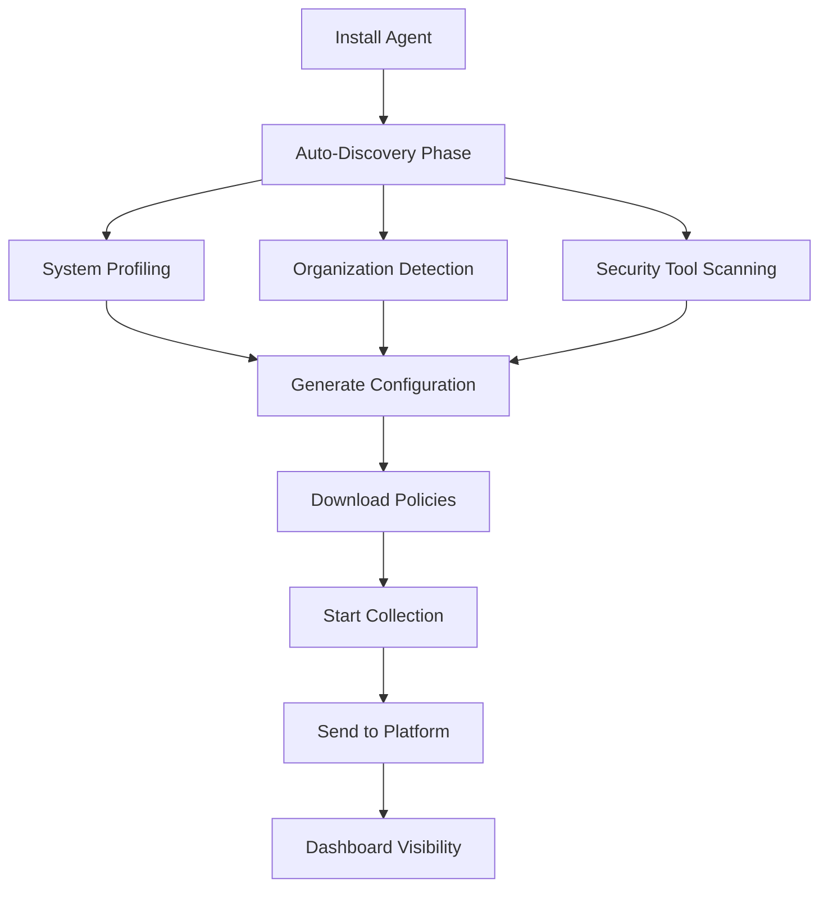

# ThreatGuard Agent - Zero-Config Endpoint Collector

[](https://opensource.org/licenses/MIT)
[]()
[]()
[]()
[]()

## Overview

ThreatGuard Agent is a revolutionary zero-configuration endpoint security collector built on Fluent Bit foundations. It provides enterprise-grade log collection, filtering, and transmission with **complete automation** - no configuration files, no setup wizards, no specialized knowledge required.

### Key Features

- **🚀 Zero-Config Deployment**: Single command installation with automatic discovery
- **🔍 Intelligent Discovery**: Auto-detects OS, services, and security tools
- **⚡ Minimal Footprint**: <20MB install, <50-80MB RAM, <2% CPU usage
- **🛡️ Enterprise Security**: TLS 1.2/1.3, signed configs, automatic compliance
- **🔄 Auto-Management**: Silent updates, remote configuration, self-healing
- **📊 Smart Filtering**: 70%+ compression with security-focused filtering
- **🌐 Multi-Platform**: Windows, Linux, macOS with native APIs

## Quick Start

### Development Setup

```bash
# Clone and build from source
git clone https://github.com/bg-threat-ai/threatguard-agent.git
cd threatguard-agent

# Install dependencies and build
npm run quick-start

# Run the agent
./dist/threatguard-agent --help

# Test the implementation
npm run test:agent
```

### One-Command Installation

```bash
# Windows (PowerShell as Administrator)
msiexec /i ThreatGuardAgent.msi /quiet

# Linux (Ubuntu/Debian)
sudo dpkg -i threatguard-agent.deb

# Linux (RHEL/CentOS)
sudo rpm -i threatguard-agent.rpm

# macOS
sudo installer -pkg ThreatGuardAgent.pkg -target /

# That's it! No configuration needed - agent auto-configures in 60 seconds
```

### Verification

```bash
# Check agent status (all platforms)
curl http://localhost:8888/status

# Expected response:
{
  "status": "active",
  "organization": "auto-detected",
  "profile": "enterprise_security",
  "collection_rate": "150 events/second",
  "uptime": "00:05:23",
  "health": "healthy"
}
```

## Architecture

### Zero-Config Discovery Process



### Component Architecture

```
┌─────────────────────────────────────────┐
│            ThreatGuard Agent            │
├─────────────────────────────────────────┤
│  Zero-Config Wrapper & Auto-Discovery  │
├─────────────────────────────────────────┤
│         Fluent Bit Core Engine          │
├─────────────────────────────────────────┤
│  Input Plugins │ Filter Plugins │ Output│
│  - EventLog    │ - Auto-Filter  │ - HTTPS│
│  - Syslog      │ - Compression  │ - TLS  │
│  - OSQuery     │ - Encryption   │ - Batch│
└─────────────────────────────────────────┘
```

## Project Structure

```
threatguard-agent/
├── src/
│   ├── wrapper/              # Zero-config wrapper logic
│   │   ├── discovery/        # Auto-discovery engines
│   │   ├── config/           # Configuration generation
│   │   └── management/       # Remote management
│   ├── fluent-bit/          # Fluent Bit integration
│   │   ├── configs/         # Template configurations
│   │   ├── plugins/         # Custom plugins
│   │   └── filters/         # Security-focused filters
│   ├── platform/            # Platform-specific code
│   │   ├── windows/         # Windows implementation
│   │   ├── linux/           # Linux implementation
│   │   └── macos/           # macOS implementation
│   └── common/              # Shared utilities
├── installers/              # Platform installers
│   ├── windows/             # MSI installer
│   ├── linux/               # DEB/RPM packages
│   └── macos/               # PKG installer
├── configs/                 # Configuration templates
│   ├── templates/           # Base templates
│   ├── profiles/            # Compliance profiles
│   └── filters/             # Security filters
├── scripts/                 # Build and deployment
├── tests/                   # Comprehensive tests
└── docs/                    # Documentation
```

## Auto-Discovery Features

### Automatic Organization Detection

- **Active Directory Integration**: Uses domain credentials for auto-registration
- **Certificate Store Analysis**: Detects corporate certificates for organization mapping
- **DNS Discovery**: Checks for `_bg-threat-org` TXT records
- **Cloud Metadata**: Reads AWS/Azure instance metadata for organization hints
- **Network Scanning**: Discovers local management services

### Intelligent System Profiling

- **Operating System**: Version, architecture, security features
- **Installed Software**: Security tools, databases, web servers
- **Running Services**: Active processes and their log sources
- **Performance Capacity**: CPU, memory, disk, network capabilities
- **Compliance Environment**: Detects PCI, HIPAA, SOX requirements

### Security Tool Integration

Automatically detects and integrates with:

- **CrowdStrike Falcon**: Native API integration
- **Microsoft Defender**: Event logs + WMI queries
- **Symantec Endpoint**: Log file monitoring
- **Carbon Black**: API integration
- **Suricata/Zeek**: EVE JSON parsing
- **OSQuery**: Scheduled query execution

## Performance Specifications

| Metric | Target | Monitoring |
|--------|--------|------------|
| **CPU Usage** | ≤ 2% average | Continuous monitoring |
| **Memory Usage** | ≤ 50-80 MB | Memory leak prevention |
| **Disk Footprint** | ≤ 20 MB | Compressed installation |
| **Network Usage** | <50 Kbps average | Smart compression |
| **Startup Time** | <5 seconds | Service initialization |
| **Log Processing** | 10,000+ events/second | Throughput validation |

## Security Features

### Transport Security
- **TLS 1.2/1.3** encryption for all communications
- **Certificate Validation** with hostname verification
- **Client Certificates** for enhanced authentication (optional)
- **Signed Configurations** with digital signature validation

### Data Protection
- **Pre-transmission Encryption** using AES-256
- **Compression** with 70%+ reduction ratio
- **Secure Storage** of credentials in OS keystore
- **Audit Trail** of all configuration changes

### Runtime Security
- **Process Isolation** with dedicated service account
- **Minimal Privileges** following principle of least privilege
- **Anti-tampering** protection with integrity monitoring
- **Secure Updates** with signature verification

## Development

### Prerequisites

```bash
# Install development dependencies
npm install

# Or use our auto-setup script
curl -fsSL https://setup.threatguard.ai/dev | bash
```

### Building

```bash
# Build all platforms
npm run build

# Build specific platform
npm run build:windows
npm run build:linux
npm run build:macos

# Create installers
npm run package
```

### Testing

```bash
# Run comprehensive test suite
npm test

# Run platform-specific tests
npm run test:windows
npm run test:linux
npm run test:macos

# Performance benchmarks
npm run benchmark
```

## Deployment

### Enterprise Deployment

#### Group Policy (Windows)
```powershell
# Deploy via GPO - no configuration needed
New-GPO -Name "ThreatGuard Agent Deployment"
```

#### Ansible (Linux)
```yaml
- name: Deploy ThreatGuard Agent
  package:
    name: threatguard-agent
    state: present
```

#### Jamf Pro (macOS)
```bash
# Deploy via MDM - zero configuration
jamf policy -trigger threatguard-install
```

### Cloud Deployment

#### AWS Systems Manager
```bash
aws ssm send-command \
  --document-name "InstallThreatGuardAgent" \
  --targets "Key=tag:Environment,Values=production"
```

#### Azure Arc
```bash
az connectedmachine extension create \
  --name "ThreatGuardAgent" \
  --publisher "BG-Threat-AI"
```

### Container Deployment

#### Docker
```dockerfile
FROM ubuntu:22.04
RUN apt-get update && apt-get install -y threatguard-agent
```

#### Kubernetes
```yaml
apiVersion: apps/v1
kind: DaemonSet
metadata:
  name: threatguard-agent
spec:
  template:
    spec:
      containers:
      - name: threatguard-agent
        image: threatguard/agent:latest
```

## Configuration Profiles

### Automatic Compliance Profiles

#### PCI DSS Profile
```yaml
# Auto-applied when payment processing detected
pci_dss:
  mandatory_logs:
    - authentication_events
    - authorization_events
    - data_access_logs
  retention: "12_months"
  encryption: "required"
  real_time_monitoring: true
```

#### HIPAA Profile
```yaml
# Auto-applied when healthcare software detected
hipaa:
  mandatory_logs:
    - phi_access_logs
    - audit_trails
    - security_events
  encryption: "required"
  access_logging: "comprehensive"
  retention: "6_years"
```

#### SOX Profile
```yaml
# Auto-applied for public companies
sox:
  mandatory_logs:
    - financial_system_access
    - database_changes
    - privilege_escalations
  retention: "7_years"
  immutable_storage: true
```

## API Reference

### Local Management API

```bash
# Agent status
GET http://localhost:8888/status

# Configuration reload
POST http://localhost:8888/config/reload

# Health check
GET http://localhost:8888/health

# Metrics
GET http://localhost:8888/metrics

# Logs
GET http://localhost:8888/logs?lines=100
```

### Response Examples

#### Status Response
```json
{
  "agent_id": "tg-agent-win-001",
  "version": "2.0.1",
  "status": "active",
  "organization": "Acme Corp",
  "profile": "enterprise_security",
  "uptime": "2d 14h 32m",
  "health": "healthy",
  "collection_stats": {
    "events_processed": 1547892,
    "events_filtered": 234567,
    "events_transmitted": 1313325,
    "compression_ratio": 0.72,
    "error_rate": 0.001
  },
  "system_info": {
    "os": "Windows 11 Pro",
    "cpu_usage": 1.2,
    "memory_usage": 67.8,
    "disk_usage": 18.4
  }
}
```

## Support

### Community Support
- **GitHub Issues**: [Report bugs and request features](https://github.com/bg-threat-ai/threatguard-agent/issues)
- **Documentation**: [Complete documentation](https://docs.threatguard.ai)
- **Community Forum**: [Get help from the community](https://community.threatguard.ai)

### Enterprise Support
- **24/7 Support**: Premium support for enterprise customers
- **Professional Services**: Deployment assistance and customization
- **Training**: Comprehensive training programs

### Troubleshooting

#### Common Issues

**Agent not starting**
```bash
# Check service status
systemctl status threatguard-agent

# Check logs
journalctl -u threatguard-agent -f
```

**Configuration issues**
```bash
# Trigger auto-reconfiguration
curl -X POST http://localhost:8888/config/reload

# Check auto-discovery status
curl http://localhost:8888/discovery/status
```

**Performance issues**
```bash
# Check resource usage
curl http://localhost:8888/metrics

# Enable debug logging
curl -X POST http://localhost:8888/config/debug
```

## Contributing

We welcome contributions! Please see our [Contributing Guide](CONTRIBUTING.md) for details.

### Development Workflow

1. Fork the repository
2. Create a feature branch
3. Make your changes
4. Add tests
5. Run the test suite
6. Submit a pull request

## License

This project is licensed under the MIT License - see the [LICENSE](LICENSE) file for details.

## Roadmap

### Version 2.1 (Q2 2025)
- Enhanced ML integration with local threat scoring
- Behavioral analysis with endpoint behavior profiling
- Advanced compression algorithms
- Mobile platform support (iOS/Android)

### Version 2.2 (Q3 2025)
- Edge computing capabilities
- Zero-trust integration
- Kubernetes-native deployment
- Real-time local analytics

### Version 3.0 (Q4 2025)
- AI-powered filtering with machine learning
- Predictive collection capabilities
- Multi-cloud native optimizations
- Quantum-safe cryptography

---

**ThreatGuard Agent** - The next generation of enterprise endpoint security collectors with revolutionary zero-configuration deployment.

*Developed by BG Threat AI - Securing the digital frontier.*